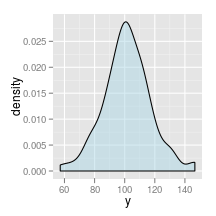
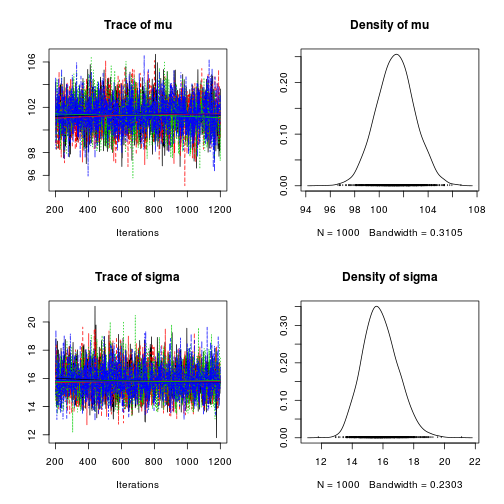

<!-- Fit normal distribution to some data -->

The following post shows an example of fitting a normal distribution with unknown mean and variance to data.

<!-- more -->
Observed data are $latex y_i$ where $latex i=1, \ldots, I$.  The data is modelled as independent observations drawn from a normal distribution with unknown variance:
$$latex y_i \sim N(\mu, \sigma^2)$$

The inverse of the variance $latex \sigma^2$ is the precision $latex \tau$. 

$$latex \tau = \frac{1}{\sigma^2}$$

Noninformative priors are placed on $latex \mu$ and $latex \tau$

$$latex \mu \sim N(0, 0.001)$$
$$latex \tau \sim \Gamma(0.001, 0.001)$$


# Import packages


```r
rm(list = ls())
library(rjags)
library(coda)
library(ggplot2)
```


## Simulate data


```r
set.seed(4444)
N <- 100  # number of subjects
Mu <- 100
Sigma <- 15  # standard deviation of error

y <- rnorm(n = N, mean = Mu, sd = Sigma)
Data <- data.frame(y)

# Convert data to input format required by JAGS
jagsdata <- list(y = y)
```


## Traditional analysis


```r
ggplot(Data, aes(x = y)) + geom_density(fill = "lightblue", alpha = 0.5)
```

 

```r
c(n = length(y), mean = mean(y), sd = sd(y), se.mean = sd(y)/sqrt(length(y)))
```


```
##       n    mean      sd se.mean 
## 100.000 101.585  15.734   1.573 
```


# Specify and export BUGS model


```r
jags.script <- "
model {
    # Model
    for (i in 1:length(y)) {
        y[i]  ~ dnorm(mu, tau)
    }
    
    # Priors
    mu  ~ dnorm(0, 0.001);
    tau ~ dgamma(0.001, 0.001);
    
    # Transformations
    sigma  <- 1.0/sqrt(tau);
}
"
```


## Bayesian analysis


```r
mod1 <- jags.model(textConnection(jags.script), data = jagsdata, 
    n.chains = 4, n.adapt = 1000)
```


```
## Compiling model graph
##    Resolving undeclared variables
##    Allocating nodes
##    Graph Size: 107
## 
## Initializing model
## 
```


```r
update(mod1, 200)  # burn in

# monitor
mod1.samples <- coda.samples(model = mod1, variable.names = c("mu", 
    "sigma"), n.iter = 1000)
```


## Model summary and diagnostics


```r
plot(mod1.samples)  # plot trace and posterior density for each parameter
```

 

```r
summary(mod1.samples)  # print descriptive statistics of posterior densities for parameters
```


```
## 
## Iterations = 201:1200
## Thinning interval = 1 
## Number of chains = 4 
## Sample size per chain = 1000 
## 
## 1. Empirical mean and standard deviation for each variable,
##    plus standard error of the mean:
## 
##        Mean   SD Naive SE Time-series SE
## mu    101.3 1.56   0.0247         0.0250
## sigma  15.8 1.15   0.0181         0.0164
## 
## 2. Quantiles for each variable:
## 
##       2.5% 25%   50%   75% 97.5%
## mu    98.3 100 101.4 102.4 104.4
## sigma 13.8  15  15.8  16.6  18.2
## 
```


