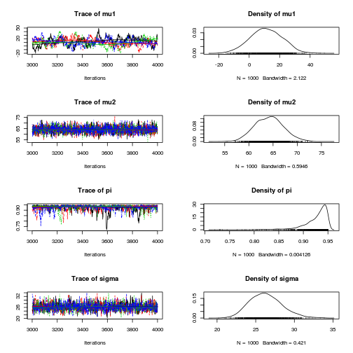

Model data drawn from two different latent normal distributions distributions
with different means but the same standard deviations

# Import packages


```r
rm(list = ls())
library(rjags)
library(coda)
library(lattice)
```


# Specify and export BUGS model


```r
modelstring <- "
model {
    # Model
    for (i in 1:length(y)) {
        s[i] ~ dbern(pi)
        mu[i] <- mu1 + s[i] * muplus;
        y[i] ~ dnorm(mu[i], tau);
    }

    # Priors
    pi ~ dbeta(1.0, 1.0);
    mu1 ~ dnorm(0, 1.0E-3);
    muplus ~ dunif(0, 1.0E+3);
    tau ~ dgamma(1.0E-3, 1.0E-3);    
    
    # Transformations
    sigma  <- 1.0/sqrt(tau);
    mu2 <- mu1 + muplus
}
"

writeLines(modelstring, "model.txt")
```


# Simulate data


```r
set.seed(4444)
N <- 100  # number of subjects
Pi <- 0.3
Mu1 <- 100
Sigma1 <- 15  # standard deviation of error
Mu2 <- 50
Sigma2 <- 15  # standard deviation of error

S <- rbinom(n = N, size = 1, prob = Pi)
y <- ifelse(S, rnorm(n = N, mean = Mu1, sd = Sigma1), rnorm(n = N, 
    mean = Mu2, sd = Sigma2))
Data <- data.frame(s = S, y)


# Convert data to input format required by JAGS
jagsdata <- list(y = y)
```


# Traditional analysis


```r
boxplot(y ~ factor(s), Data)
```

 


# Bayesian analysis


```r
mod1 <- jags.model("model.txt", data = jagsdata, n.chains = 4, n.adapt = 1000)
```


```
## Compiling model graph
##    Resolving undeclared variables
##    Allocating nodes
##    Graph Size: 411
## 
## Initializing model
## 
```


```r
update(mod1, 1000)  # burn in

# monitor
mod1.samples <- coda.samples(model = mod1, variable.names = c("mu1", 
    "mu2", "sigma", "pi"), n.iter = 1000)

# Model summary and diagnostics
plot(mod1.samples)  # plot trace and posterior density for each parameter
```

 

```r
summary(mod1.samples)  # print descriptive statistics of posterior densities for parameters
```


```
## 
## Iterations = 2001:3000
## Thinning interval = 1 
## Number of chains = 4 
## Sample size per chain = 1000 
## 
## 1. Empirical mean and standard deviation for each variable,
##    plus standard error of the mean:
## 
##          Mean     SD Naive SE Time-series SE
## mu1    52.775 2.2737 0.035950        0.06704
## mu2   105.720 4.7740 0.075484        0.16499
## pi      0.249 0.0516 0.000815        0.00141
## sigma  16.772 1.6016 0.025324        0.04861
## 
## 2. Quantiles for each variable:
## 
##         2.5%     25%     50%     75%   97.5%
## mu1   48.212  51.298  52.747  54.218  57.247
## mu2   96.460 102.625 105.657 108.913 114.871
## pi     0.156   0.214   0.247   0.284   0.356
## sigma 14.214  15.657  16.578  17.640  20.374
## 
```


# sample classification


