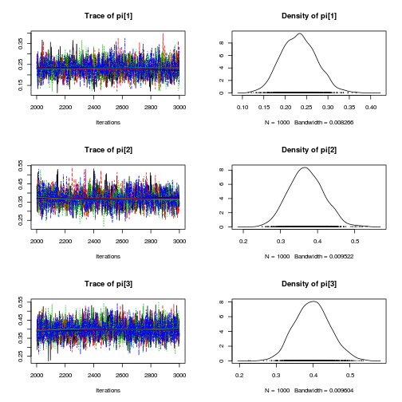

$latex y_i$ is drawn from a categorical distribution with three categories.

$$p(y) = \pi_1^{[y=1]}, \pi_2^{[y=2]}, \pi_3^{[y=3]}$$
$$latex \pi = \beta$$
$$latex \beta_1 \sim Unif(0, 1)$$
$$latex \beta_2 \sim Unif(0, 1 - \beta_1)$$
$$latex \beta_3 \sim Unif(0, 1 - \beta_1 - \beta_2)$$


# Setup


```r
rm(list = ls())
require(rjags)
require(coda)
```


# Generate data


```r
N <- 100
y <- sample(1:3, replace = TRUE, size = N, prob = c(0.2, 0.3, 0.5))
Data <- list(y = y)
```


# Specify JAGS script


```r
jags.script <- "
model{
    # likelihood
    for( i in 1:length(y)) {
        y[i] ~ dcat(pi)
    }

    # priors
    Beta[1] ~ dunif(0, 1)
    Beta[2] ~ dunif(0, 1-Beta[1])
    Beta[3] <- 1 - Beta[1] - Beta[2]
    pi <- Beta
}
"
```


# Perform Bayesian analysis using JAGS


```r
jags.fit <- jags.model(textConnection(jags.script), data = Data, 
    n.chains = 4, n.adapt = 1000)
```


```
## Compiling model graph
##    Resolving undeclared variables
##    Allocating nodes
##    Graph Size: 107
## 
## Initializing model
## 
```


```r

update(jags.fit, n.iter = 1000)  # burnin

jags.samples <- coda.samples(model = jags.fit, variable.names = c("pi"), 
    n.iter = 1000)
plot(jags.samples)  # plot trace and posterior density for each parameter
```

 

```r
summary(jags.samples)  # print descriptive statistics of posterior densities for parameters
```


```
## 
## Iterations = 2001:3000
## Thinning interval = 1 
## Number of chains = 4 
## Sample size per chain = 1000 
## 
## 1. Empirical mean and standard deviation for each variable,
##    plus standard error of the mean:
## 
##        Mean     SD Naive SE Time-series SE
## pi[1] 0.232 0.0410 0.000648       0.001026
## pi[2] 0.370 0.0472 0.000746       0.001257
## pi[3] 0.398 0.0476 0.000753       0.000822
## 
## 2. Quantiles for each variable:
## 
##        2.5%   25%   50%   75% 97.5%
## pi[1] 0.156 0.203 0.232 0.260 0.314
## pi[2] 0.282 0.337 0.368 0.401 0.463
## pi[3] 0.309 0.365 0.398 0.430 0.495
## 
```


