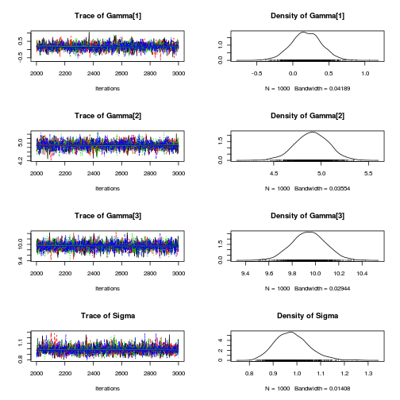

r opts_chunk$set(cache=TRUE)

Data are observed on observations $y_i$, where $latex i=1, \ldots, I$.
Data are normally distributed with mean $latex \mu_i$ and constant variance.

$$latex y_i \sim N(\mu_i, \sigma^2)$$

$latex \mu_i$ is equal to the mean of the $latex \gamma_j$, the mean of the $latex j$th latent group.

$$latex \mu_i = \sum_{j=1}^3 \beta_{ji} \gamma_j$$

$latex \beta_{ji}$ indicates whether individual $latex i$ is a member of the $latex j$th latent group.

$$latex \beta_{ji} = \begin{cases} 
    1 & \text{if $x x=j$,}    \\
    0 &\text{otherwise}
\end{cases}$$

$$latex x_i \sim \text{Cat}(\pi)$$

The priors on the probability of membership of each of the three latent groups are

$$latex \pi_1 \sim \text{Unif}(0, 1)$$
$$latex \pi_2 \sim \text{Unif}(0, 1 - \pi_1)$$
$$latex \pi_3 = 1 - \pi_1 - \pi_2.$$

$latex \pi_3$ is constrained so that once $latex \pi_1$ and $latex \pi_2$ are known, the probabilities must sum to 1.0. 

These are the priors on the means of each of the latent groups.

$$latex \gamma_1 \sim \text{Unif}(-100, 100)$$
$$latex \gamma_2 \sim \text{Unif}(\gamma_1, 100)$$
$$latex \gamma_3 \sim \text{Unif}(\gamma_2, 100)$$
The priors are structured to ensure that an order is maintained such that $latex \gamma_1$ is the lowest and $latex \gamma_3$ is the highest.

An uninformative prior is placed on precision:

$$latex \tau = \frac{1}{\sigma^2}$$
$$latex \tau \sim \text{Unif}(0, 1000)$$


# Setup


```r
rm(list = ls())
require(rjags)
require(coda)
```


# Generate data


```r
N <- 100

x <- sample(1:3, replace = TRUE, size = N, prob = c(0.2, 0.3, 0.5))
Beta1 <- as.numeric(x == 1)
Beta2 <- as.numeric(x == 2)
Beta3 <- as.numeric(x == 3)
Gamma <- c(0, 5, 10)  # latent group means

Mu <- Beta1 * Gamma[1] + Beta2 * Gamma[2] + Beta3 * Gamma[3]
Sigma <- 1
y <- rnorm(N, Mu, Sigma)

Data <- list(y = y)
```


# Basic data analysis


```r
par(mfrow = c(1, 2))
plot(density(y))
boxplot(y ~ x)
```

 


# Specify JAGS model


```r
jags.script <- "
model{
    # likelihood
    for( i in 1:length(y)) {
        x[i] ~ dcat(Pi)
        Beta1[i] <- x[i] == 1
        Beta2[i] <- x[i] == 2
        Beta3[i] <- x[i] == 3
        Mu[i] <- Beta1[i] * Gamma[1] + 
            Beta2[i] * Gamma[2] + 
            Beta3[i] * Gamma[3]
        y[i] ~ dnorm(Mu[i], Tau)
    }

    # priors
    Pi[1] ~ dunif(0, 1)
    Pi[2] ~ dunif(0, 1-Pi[1])
    Pi[3] <- 1 - Pi[1] - Pi[2]

    Gamma[1] ~ dunif(-100, 100)
    Gamma[2] ~ dunif(Gamma[1], 100)
    Gamma[3] ~ dunif(Gamma[2], 100)
    Tau ~ dunif(0, 1000)    
    Sigma <- Tau ^ -0.5
}
"
```


# Perform Bayesian analysis using JAGS


```r
jags.fit <- jags.model(textConnection(jags.script), data = Data, 
    n.chains = 4, n.adapt = 1000)
```


```
## Compiling model graph
##    Resolving undeclared variables
##    Allocating nodes
##    Graph Size: 919
## 
## Initializing model
## 
```


```r

update(jags.fit, n.iter = 1000)  # burnin

jags.samples <- coda.samples(model = jags.fit, variable.names = c("Gamma", 
    "Sigma"), n.iter = 1000)

plot(jags.samples)  # plot trace and posterior density for each parameter
```

 

```r
(summary.jags.model <- summary(jags.samples))
```


```
## 
## Iterations = 2001:3000
## Thinning interval = 1 
## Number of chains = 4 
## Sample size per chain = 1000 
## 
## 1. Empirical mean and standard deviation for each variable,
##    plus standard error of the mean:
## 
##              Mean     SD Naive SE Time-series SE
## Gamma[1]  0.00764 0.2460  0.00389        0.00535
## Gamma[2]  5.53657 0.2021  0.00320        0.00449
## Gamma[3] 10.15669 0.1332  0.00211        0.00264
## Sigma     0.97844 0.0752  0.00119        0.00169
## 
## 2. Quantiles for each variable:
## 
##            2.5%    25%      50%    75%  97.5%
## Gamma[1] -0.470 -0.158  0.00552  0.171  0.497
## Gamma[2]  5.151  5.405  5.53101  5.666  5.939
## Gamma[3]  9.898 10.066 10.15494 10.243 10.425
## Sigma     0.845  0.926  0.97373  1.026  1.141
## 
```


```r
cbind(True = c(Gamma, Sigma), round(summary.jags.model$statistics[, 
    1:2], 3), round(summary.jags.model$quantiles[, c(1, 5)], 3))
```


```
##          True   Mean    SD   2.5%  97.5%
## Gamma[1]    0  0.008 0.246 -0.470  0.497
## Gamma[2]    5  5.537 0.202  5.151  5.939
## Gamma[3]   10 10.157 0.133  9.898 10.425
## Sigma       1  0.978 0.075  0.845  1.141
```


