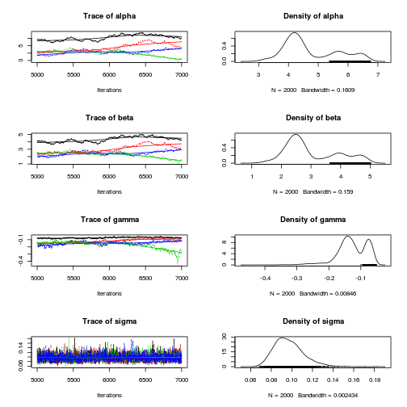
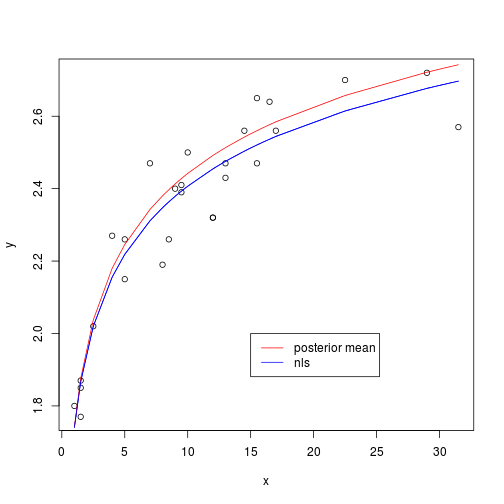

# Warning: This program currently has estimation issues.

The following provides an example of fitting a nonlinear regression model in JAGS.

This example is adapted from [the following website](http://www.dme.ufrj.br/mcmc/nonlinearmodel-R2WinBUGS.html) which supports the book "Markov Chain Monte Carlo"  by Danny Gamerman and Hedibert Freitas Lopes.  The original example was designed to be run using R2WinBUGS.

$$latex y_i \sim N(\alpha - \beta x_i^{-\gamma}, \sigma^2)$$

where $latex \alpha$, $latex \beta$, and $latex \gamma$ are parameters.

I've modified the example somewhat:

* It now uses JAGS and the R packages `rjags` and `coda` 
* I'm not sure if there was a bug in the orginal code but I had to add some code 
  to reverse the gamma parameter to effectively give it a prior between -1 and 0
* I  compare the fit obtained with a non-Bayesian approach using the nls function
* I use the modelstring convention I picked up from John Kruschke. 
  This lets you run the entire script in a self-contained way in a single file.
* I was also assited by [John Myels White's example](http://www.johnmyleswhite.com/notebook/2010/08/29/mcmc-diagnostics-in-r-with-the-coda-package/)

# Load packages


```r
rm(list = ls())
require(rjags)
require(coda)
```


# Prepare data


```r
x <- c(1, 1.5, 1.5, 1.5, 2.5, 4, 5, 5, 7, 8, 8.5, 9, 9.5, 9.5, 10, 
    12, 12, 13, 13, 14.5, 15.5, 15.5, 16.5, 17, 22.5, 29, 31.5)
y <- c(1.8, 1.85, 1.87, 1.77, 2.02, 2.27, 2.15, 2.26, 2.47, 2.19, 
    2.26, 2.4, 2.39, 2.41, 2.5, 2.32, 2.32, 2.43, 2.47, 2.56, 2.65, 2.47, 2.64, 
    2.56, 2.7, 2.72, 2.57)
Data <- list(x = x, y = y)
Data[["maxy"]] <- max(Data[["y"]])
```


# Perform non-Bayesian analysis


```r
nlsfit <- nls(y ~ alpha - beta * x^gamma, start = list(alpha = 3, 
    beta = 2, gamma = -0.2))
summary(nlsfit)
```


```
## 
## Formula: y ~ alpha - beta * x^gamma
## 
## Parameters:
##       Estimate Std. Error t value Pr(>|t|)
## alpha   5.8288     6.7998    0.86     0.40
## beta    4.0884     6.7620    0.60     0.55
## gamma  -0.0773     0.1462   -0.53     0.60
## 
## Residual standard error: 0.0912 on 24 degrees of freedom
## 
## Number of iterations to convergence: 4 
## Achieved convergence tolerance: 1.52e-06 
## 
```


* `nls` provides a least squares estimate of the parameter values.
* This equation was `5.83` - `4.09` x ^ `-0.077`.


```r
plot(x, y)
lines(x, predict(nlsfit), col = "blue")  # add fit line
```

 


# Export JAGS model


```r
jags.script <- "
model{
    # likelihood
    for( i in 1:length(x[])) {
        y[i] ~ dnorm(mu[i], tau)
        mu[i] <- alpha - beta * x[i] ^ gamma
    }

    # priors
    alpha ~ dunif(maxy, 10)
    beta  ~ dunif(0, alpha)
    gamma ~ dunif(-1, 0)    
    tau  ~ dgamma(0.01, 0.01)
    
    sigma <- 1 / sqrt(tau)
}
" # Model string
```


# Perform Bayesian analysis using JAGS


```r
mod1 <- jags.model(textConnection(jags.script), data = Data, n.chains = 4, 
    n.adapt = 1000)
```


```
## Compiling model graph
##    Resolving undeclared variables
##    Allocating nodes
##    Graph Size: 126
## 
## Initializing model
## 
```


```r
update(mod1, 4000)

mod1.samples <- coda.samples(model = mod1, variable.names = c("alpha", 
    "beta", "gamma", "sigma"), n.iter = 2000)
plot(mod1.samples)  # plot trace and posterior density for each parameter
```

 

```r
summary(mod1.samples)  # print descriptive statistics of posterior densities for parameters
```


```
## Warning message: step size truncated due to divergence
```


```
## Warning message: step size truncated due to divergence
```


```
## Warning message: step size truncated due to divergence
```


```
## Warning message: glm.fit: algorithm did not converge
```


```
## Warning message: glm.fit: algorithm did not converge
```


```
## Warning message: glm.fit: algorithm did not converge
```


```
## 
## Iterations = 5001:7000
## Thinning interval = 1 
## Number of chains = 4 
## Sample size per chain = 2000 
## 
## 1. Empirical mean and standard deviation for each variable,
##    plus standard error of the mean:
## 
##          Mean     SD Naive SE Time-series SE
## alpha  4.7358 0.9160 0.010241             NA
## beta   3.0113 0.9052 0.010121             NA
## gamma -0.1272 0.0482 0.000538       0.001946
## sigma  0.0971 0.0144 0.000161       0.000215
## 
## 2. Quantiles for each variable:
## 
##         2.5%     25%     50%     75%   97.5%
## alpha  3.362  4.0808  4.3815  5.5815  6.5452
## beta   1.686  2.3568  2.6648  3.8414  4.8203
## gamma -0.250 -0.1525 -0.1287 -0.0844 -0.0616
## sigma  0.074  0.0869  0.0954  0.1054  0.1304
## 
```


```r

cor(mod1.samples[[1]])
```


```
##         alpha    beta    gamma    sigma
## alpha 1.00000 0.99003  0.79105  0.03584
## beta  0.99003 1.00000  0.70662  0.04425
## gamma 0.79105 0.70662  1.00000 -0.00601
## sigma 0.03584 0.04425 -0.00601  1.00000
```


# Compare model prediction 
This compares

1.  means of posteriors of parameters
2. least squares estimates of parameters


```r
alpha.posterior.mean <- summary(mod1.samples)$statistics["alpha", 
    "Mean"]
beta.posterior.mean <- summary(mod1.samples)$statistics["beta", "Mean"]
gamma.posterior.mean <- summary(mod1.samples)$statistics["gamma", 
    "Mean"]
```


```r
plot(x, y)
lines(x, predict(nlsfit), col = "blue")  # add fit line
ypred <- alpha.posterior.mean - beta.posterior.mean * x^(gamma.posterior.mean)
lines(x, ypred, col = "red")
lines(x, predict(nlsfit), col = "blue")  # add fit line
legend(x = 15, y = 2, legend = c("posterior mean", "nls"), col = c("red", 
    "blue"), lty = 1)
```

 

