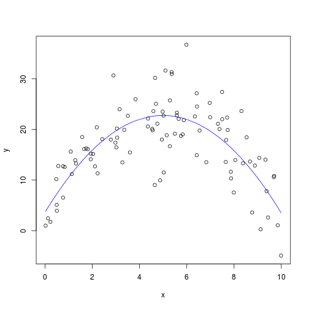
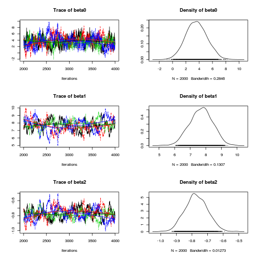
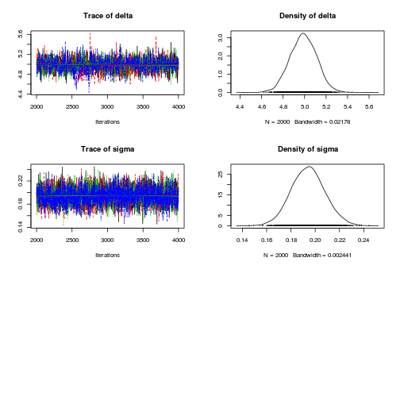
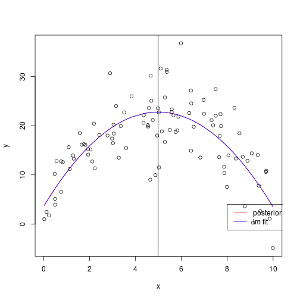
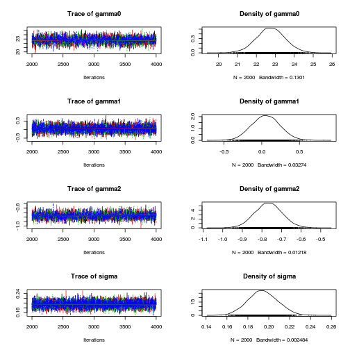

$$latex y_i \sim N(\beta_0  + \beta_1 x_i  + \beta_2  x_i^2, \sigma^2)$$


```r
rm(list = ls())
require(rjags)
require(coda)
library(xtable)
```


# Generate data


```r
set.seed(4444)
Beta0 <- 2
Beta1 <- 8
Beta2 <- -0.8
N <- 100
Sigma <- 5

x <- runif(n = N, min = 0, max = 10)
y <- Beta0 + Beta1 * x + Beta2 * x^2 + rnorm(n = N, mean = 0, sd = Sigma)
Data <- list(x = x, y = y)
```


# Non-Bayesian analysis


```r
lmfit <- lm(y ~ x + I(x^2))
summary(lmfit)
```


```
## 
## Call:
## lm(formula = y ~ x + I(x^2))
## 
## Residuals:
##     Min      1Q  Median      3Q     Max 
## -13.648  -3.327  -0.102   3.161  14.757 
## 
## Coefficients:
##             Estimate Std. Error t value Pr(>|t|)    
## (Intercept)   3.6747     1.5349    2.39    0.019 *  
## x             7.6587     0.6977   10.98   <2e-16 ***
## I(x^2)       -0.7679     0.0683  -11.24   <2e-16 ***
## ---
## Signif. codes:  0 '***' 0.001 '**' 0.01 '*' 0.05 '.' 0.1 ' ' 1 
## 
## Residual standard error: 5.14 on 97 degrees of freedom
## Multiple R-squared: 0.566,	Adjusted R-squared: 0.557 
## F-statistic: 63.3 on 2 and 97 DF,  p-value: <2e-16 
## 
```


```r
plot(x, y)
lines(x[order(x)], predict(lmfit)[order(x)], col = "blue")  # add fit line
```

 


# Define JAGS model


```r
jags.script <- "
model{
    # likelihood
    for( i in 1:length(x[])) {
        y[i] ~ dnorm(mu[i], tau)
        mu[i] <- beta0 + beta1 * x[i] + beta2 * pow(x[i], 2)
    }

    # priors
    beta0 ~ dnorm(0.0, 1.0E-6)
    beta1  ~ dnorm(0.0, 1.0E-6)
    beta2  ~ dunif(-10000, -0.01) # exclude zero to permit turning point
    tau  ~ dgamma(0.1,0.1)

    # transformations
    sigma <- pow(tau, 0.5)
    delta <- (0 - beta1) / (2 * beta2)
}
" 
```


# Perform Bayesian analysis using JAGS


```r
jags.fit <- jags.model(textConnection(jags.script), data = Data, 
    n.chains = 4, n.adapt = 1000)
```


```
## Compiling model graph
##    Resolving undeclared variables
##    Allocating nodes
##    Graph Size: 617
## 
## Initializing model
## 
```


```r

update(jags.fit, n.iter = 1000)  # burnin

jags.samples <- coda.samples(model = jags.fit, variable.names = c("beta0", 
    "beta1", "beta2", "sigma", "delta"), n.iter = 2000)
plot(jags.samples)
```

  

```r
summary(jags.samples)
```


```
## 
## Iterations = 2001:4000
## Thinning interval = 1 
## Number of chains = 4 
## Sample size per chain = 2000 
## 
## 1. Empirical mean and standard deviation for each variable,
##    plus standard error of the mean:
## 
##         Mean     SD Naive SE Time-series SE
## beta0  3.597 1.6200 0.018113       0.090698
## beta1  7.699 0.7439 0.008317       0.050512
## beta2 -0.772 0.0725 0.000810       0.004736
## delta  4.988 0.1240 0.001386       0.003092
## sigma  0.194 0.0139 0.000155       0.000188
## 
## 2. Quantiles for each variable:
## 
##         2.5%    25%    50%    75%  97.5%
## beta0  0.499  2.484  3.567  4.675  6.779
## beta1  6.247  7.205  7.720  8.203  9.076
## beta2 -0.909 -0.820 -0.773 -0.722 -0.630
## delta  4.750  4.904  4.989  5.073  5.227
## sigma  0.167  0.185  0.194  0.203  0.222
## 
```


# Compare model predictions
(a) means of posteriors of parameters
(b) least squares estimates of parameters


```r
beta0.posterior.mean <- summary(jags.samples)$statistics["beta0", 
    "Mean"]
beta1.posterior.mean <- summary(jags.samples)$statistics["beta1", 
    "Mean"]
beta2.posterior.mean <- summary(jags.samples)$statistics["beta2", 
    "Mean"]

plot(x, y)
ypred <- beta0.posterior.mean + beta1.posterior.mean * x + beta2.posterior.mean * 
    x^2
lines(x[order(x)], ypred[order(x)], col = "red")
lines(x[order(x)], predict(lmfit)[order(x)], col = "blue")  # add fit line
abline(v = summary(jags.samples)$statistics["delta", "Mean"])  # turning point
legend(x = 8, y = 4, legend = c("posterior mean", "lm fit"), col = c("red", 
    "blue"), lty = 1)
```

 


# Examine predictions
This is based on sampling values of predicted y (i.e., mu)
However, I'm not sure if this is correct ways to generate predictions from the posterior.


```r
jags.predictions <- coda.samples(model = jags.fit, variable.names = c("mu"), 
    n.iter = 1000)
jags.predictions.summary <- summary(jags.predictions)

plot(x, y)
lines(x[order(x)], jags.predictions.summary$statistics[, "Mean"][order(x)])
lines(x[order(x)], jags.predictions.summary$quantiles[, "2.5%"][order(x)], 
    lty = 2)
lines(x[order(x)], jags.predictions.summary$quantiles[, "97.5%"][order(x)], 
    lty = 2)
legend(x = 8, y = 4, legend = c("2.5%", "Mean", "97.5%"), lty = c(2, 
    1, 2))
```

 


# Compare Bayesian with lm approach


```r
# Examine correlation between parameter estimates lag0 correlation between
# parameter estimates
auto0 <- round(autocorr(jags.samples)[[1]][1, , ], 2)

auto0[!lower.tri(auto0)] <- ""

print(xtable(auto0), type = "html")
```

<!-- html table generated in R 2.15.0 by xtable 1.7-0 package -->
<!-- Tue May 29 22:43:31 2012 -->
<TABLE border=1>
<TR> <TH>  </TH> <TH> beta0 </TH> <TH> beta1 </TH> <TH> beta2 </TH> <TH> delta </TH> <TH> sigma </TH>  </TR>
  <TR> <TD align="right"> beta0 </TD> <TD>  </TD> <TD>  </TD> <TD>  </TD> <TD>  </TD> <TD>  </TD> </TR>
  <TR> <TD align="right"> beta1 </TD> <TD> -0.86 </TD> <TD>  </TD> <TD>  </TD> <TD>  </TD> <TD>  </TD> </TR>
  <TR> <TD align="right"> beta2 </TD> <TD> 0.73 </TD> <TD> -0.96 </TD> <TD>  </TD> <TD>  </TD> <TD>  </TD> </TR>
  <TR> <TD align="right"> delta </TD> <TD> -0.58 </TD> <TD> 0.26 </TD> <TD> 0.02 </TD> <TD>  </TD> <TD>  </TD> </TR>
  <TR> <TD align="right"> sigma </TD> <TD> 0 </TD> <TD> -0.02 </TD> <TD> 0.02 </TD> <TD> 0.03 </TD> <TD>  </TD> </TR>
   </TABLE>


```r
round(cov2cor(vcov(lmfit)), 2)  # compare with linear model
```


```
##             (Intercept)     x I(x^2)
## (Intercept)        1.00 -0.86   0.73
## x                 -0.86  1.00  -0.96
## I(x^2)             0.73 -0.96   1.00
```


The correlation between parameters in the posterior and the correlations of parameters estimates in the least squares analysis are almost identical in this instance.


```r
# Parameter estimates
sprintf("Beta0=%.2f; Beta1=%.2f; Beta2=%.2f", Beta0, Beta1, Beta2)  # true data generating values
```


```
## [1] "Beta0=2.00; Beta1=8.00; Beta2=-0.80"
```


```r
summary(jags.samples)$statistics  # Mean and SD of posterior
```


```
##          Mean      SD  Naive SE Time-series SE
## beta0  3.5973 1.62005 0.0181127      0.0906983
## beta1  7.6991 0.74387 0.0083167      0.0505124
## beta2 -0.7717 0.07249 0.0008104      0.0047360
## delta  4.9884 0.12400 0.0013864      0.0030916
## sigma  0.1942 0.01389 0.0001553      0.0001876
```


```r
coef(summary(lmfit))  #expected and standard error of linear model parameter estimates
```


```
##             Estimate Std. Error t value  Pr(>|t|)
## (Intercept)   3.6747    1.53495   2.394 1.859e-02
## x             7.6587    0.69775  10.976 1.061e-18
## I(x^2)       -0.7679    0.06832 -11.240 2.895e-19
```


```r
stem(jags.samples[[1]][, "delta"])
```


```
## 
##   The decimal point is 1 digit(s) to the left of the |
## 
##   46 | 2234
##   46 | 56777888999999
##   47 | 0011122222233333333444444444
##   47 | 55555555555555566666666777777777777777778888888888888888999999999999
##   48 | 00000000000000000000000111111111111111111222222222222222222222222222+49
##   48 | 55555555555555555555555556666666666666666666666666666666666666666666+109
##   49 | 00000000000000000000000000000000000000000000000111111111111111111111+184
##   49 | 55555555555555555555555555555555555555555555555555555555555666666666+222
##   50 | 00000000000000000000000000000000000000000000000000000000000000000000+216
##   50 | 55555555555555555555555555555555555555555555555555555555555555666666+193
##   51 | 00000000000000000000000000000000000000000001111111111111111111111111+136
##   51 | 55555555555555555555555555555555555556666666666666666666666666777777+43
##   52 | 000000000000011111111222222222333333333333344444
##   52 | 555555555556666777888899999
##   53 | 00112333
##   53 | 557
##   54 | 14
## 
```


# Explore mean centering
Mean centering is a way of reducing the auto-correlation in the MCMC chain.

Thus, we can specify a model as follows:

$latex y_i \sim N(\gamma_0 + \gamma_1 z_i + \gamma_2 z_i^2, \sigma^2)$ where $latex z_i = x_i - \bar{x}$.

## Define JAGS model


```r
jags.script.centered <- "
model{
    # likelihood
    for( i in 1:length(x[])) {
        z[i] <- x[i] - mean(x)
        y[i] ~ dnorm(mu[i], tau)
        mu[i] <- gamma0 + gamma1 * z[i] + gamma2 * pow(z[i], 2)
    }

    # priors
    gamma0 ~ dnorm(0.0, 1.0E-6)
    gamma1  ~ dnorm(0.0, 1.0E-6)
    gamma2  ~ dunif(-10000, -0.01) # exclude zero to permit turning point
    tau  ~ dgamma(0.1,0.1)

    # transformations
    sigma <- pow(tau, 0.5)
    
    
    # delta <- (0 - beta1) / (2 * beta2)
}
" 
```


# Perform Bayesian analysis using JAGS


```r
jags.fit.centered <- jags.model(textConnection(jags.script.centered), 
    data = Data, n.chains = 4, n.adapt = 1000)
```


```
## Compiling model graph
##    Resolving undeclared variables
##    Allocating nodes
##    Graph Size: 716
## 
## Initializing model
## 
```


```r

update(jags.fit.centered, n.iter = 1000)  # burnin

jags.samples <- coda.samples(model = jags.fit.centered, variable.names = c("gamma0", 
    "gamma1", "gamma2", "sigma"), n.iter = 2000)
plot(jags.samples)
```

 

```r
summary(jags.samples)
```


```
## 
## Iterations = 2001:4000
## Thinning interval = 1 
## Number of chains = 4 
## Sample size per chain = 2000 
## 
## 1. Empirical mean and standard deviation for each variable,
##    plus standard error of the mean:
## 
##           Mean     SD Naive SE Time-series SE
## gamma0 22.7562 0.7540 0.008430        0.01548
## gamma1  0.0548 0.1864 0.002084        0.00197
## gamma2 -0.7664 0.0697 0.000779        0.00143
## sigma   0.1944 0.0141 0.000158        0.00017
## 
## 2. Quantiles for each variable:
## 
##          2.5%     25%     50%    75%  97.5%
## gamma0 21.258 22.2612 22.7513 23.254 24.250
## gamma1 -0.304 -0.0702  0.0543  0.180  0.423
## gamma2 -0.902 -0.8129 -0.7669 -0.720 -0.627
## sigma   0.168  0.1849  0.1941  0.204  0.222
## 
```


