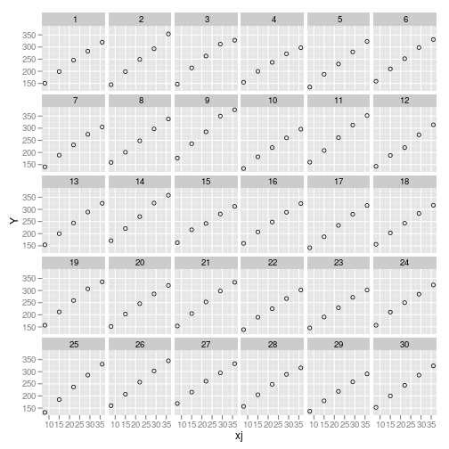
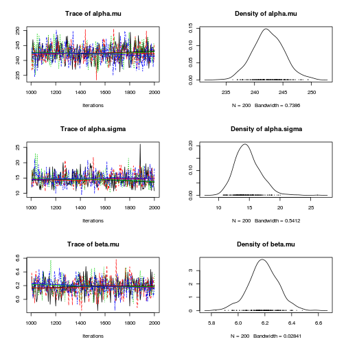
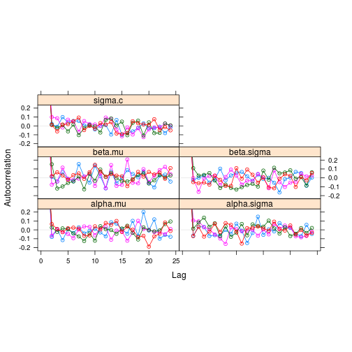
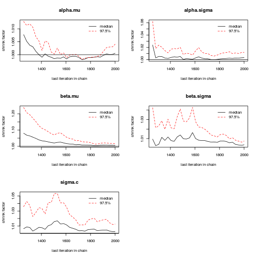

This post examines the Rats example from JAGS. 


The Rats example is based on the example in [WinBUGS](http://www.mrc-bsu.cam.ac.uk/bugs/documentation/exampVol1/node3.html), which in turn is taken from section 6 Gelfand et al (1960).  The [original JAGS code is here](http://sourceforge.net/projects/mcmc-jags/files/Examples/2.x/)

Observed data are $latex y_{ij}$ weights of rats where each rat is indexed $latex i=1, \ldots, N$, and measurements are obtained at incremental time points indexed $latex j = 1, \ldots, T$.
The actual age of rats at obsevation $latex j$ is indicated by $latex x_j$.

$$latex y_{ij} \sim N(\alpha_i + \beta_i x_{j}, \sigma^2)$$
$$latex \alpha_i ~ N(\mu_{\alpha}, \sigma^2_{\alpha})$$
$$latex \beta_i ~ N(\mu_{\beta}, \sigma^2_{\beta})$$

Noninformative normal priors were specified for $latex \mu_{\alpha}$ and $latex \mu_{\beta}$ and noninformaive Gamma priors were specified for the precision parameters.

# Load packages


```r
rm(list = ls())
library(rjags)
library(coda)
library(nlme)
library(ggplot2)
```


* `coda` supports analysis of MCMC output
* `nlme` provides functions for multilevel modelling and modelling linear regression separately for a set of individuals.

# Get data


```r
Data <- list(N = 30, T = 5, Y = structure(c(151, 145, 147, 155, 135, 
    159, 141, 159, 177, 134, 160, 143, 154, 171, 163, 160, 142, 156, 157, 152, 
    154, 139, 146, 157, 132, 160, 169, 157, 137, 153, 199, 199, 214, 200, 188, 
    210, 189, 201, 236, 182, 208, 188, 200, 221, 216, 207, 187, 203, 212, 203, 
    205, 190, 191, 211, 185, 207, 216, 205, 180, 200, 246, 249, 263, 237, 230, 
    252, 231, 248, 285, 220, 261, 220, 244, 270, 242, 248, 234, 243, 259, 246, 
    253, 225, 229, 250, 237, 257, 261, 248, 219, 244, 283, 293, 312, 272, 280, 
    298, 275, 297, 350, 260, 313, 273, 289, 326, 281, 288, 280, 283, 307, 286, 
    298, 267, 272, 285, 286, 303, 295, 289, 258, 286, 320, 354, 328, 297, 323, 
    331, 305, 338, 376, 296, 352, 314, 325, 358, 312, 324, 316, 317, 336, 321, 
    334, 302, 302, 323, 331, 345, 333, 316, 291, 324), .Dim = c(30, 5)), x = c(8, 
    15, 22, 29, 36))
```


# Preliminary data analysis


```r
Data.long <- data.frame(xj = rep(c(8, 15, 22, 29, 36), each = 30), 
    i = rep(1:30, 5), Y = as.vector(Data$Y))

lmfit <- lmList(Y ~ xj | i, Data.long[, ])
```


* `lmList` fits a linear model for each individual predicting weight (`Y`) from time (`xj`).


```r
summary(lmList(Y ~ xj | i, Data.long[Data.long$i %in% 1:5, ]))
```


```
## Call:
##   Model: Y ~ xj | i 
##    Data: Data.long[Data.long$i %in% 1:5, ] 
## 
## Coefficients:
##    (Intercept) 
##   Estimate Std. Error t value  Pr(>|t|)
## 1   107.17      9.318  11.502 7.697e-09
## 2    87.09      9.318   9.346 1.207e-07
## 3   108.23      9.318  11.616 6.737e-09
## 4   120.31      9.318  12.913 1.578e-09
## 5    84.11      9.318   9.027 1.886e-07
##    xj 
##   Estimate Std. Error t value  Pr(>|t|)
## 1    6.029     0.3862   15.61 1.105e-10
## 2    7.314     0.3862   18.94 6.946e-12
## 3    6.571     0.3862   17.01 3.237e-11
## 4    5.086     0.3862   13.17 1.203e-09
## 5    6.686     0.3862   17.31 2.529e-11
## 
## Residual standard error: 8.549 on 15 degrees of freedom
## 
```


The above code shows a summary of the output for five participants.


```r
c(
    mean_alpha = mean(sapply(lmfit, function(X) coef(X)[1])), # mean of intercept
    mean_beta = mean(sapply(lmfit, function(X) coef(X)[2])), # mean of slope
    sd_alpha = sd(sapply(lmfit, function(X) coef(X)[1])), # sd of intercept
    sd_beta = sd(sapply(lmfit, function(X) coef(X)[2])) # sd of slope
    )
```


```
## mean_alpha  mean_beta   sd_alpha    sd_beta 
##   106.5676     6.1857    12.5852     0.5784 
```


* The above code provides averages for the sample coefficients.


```r
ggplot(Data.long, aes(xj, Y)) + geom_point(shape = 1) + facet_wrap(~i)
```

 

* This lattice plot

# Specify and export BUGS model


```r
modelstring <- "
model {
    # Model
    for (i in 1:N) {
        for (j in 1:T) {
            mu[i, j] <- alpha[i] + beta[i] * (x[j] - x.bar);
            Y[i,j] ~ dnorm(mu[i,j], tau.c)
        }
        alpha[i] ~ dnorm(alpha.mu, alpha.tau);
        beta[i]  ~ dnorm(beta.mu, beta.tau);
    }

    # Priors
    alpha.mu   ~ dnorm(0, 1.0E-4);
    beta.mu    ~ dnorm(0, 1.0E-4);
    tau.c     ~ dgamma(1.0E-3, 1.0E-3);
    alpha.tau ~ dgamma(1.0E-3, 1.0E-3);
    beta.tau  ~ dgamma(1.0E-3, 1.0E-3);

    # Transformations
    alpha.sigma  <- 1.0/sqrt(alpha.tau);
    beta.sigma <- 1.0/sqrt(beta.tau);
    sigma.c    <- 1.0/sqrt(tau.c);
    x.bar    <- mean(x[]);
    alpha0   <- alpha.mu - beta.mu*x.bar;
}
"

writeLines(modelstring, "model.txt")
```


A few observations about the code above:

* The data is balanced, so it is possible to treat the dependent variable $latex y$ as a matrix.
* Various transformations are applied to values to extract meaningful values. E.g., $latex \sigma = \frac{1}{\sqrt{\tau}}$.

# Perform Bayesian analysis using JAGS


```r
mod1 <- jags.model("model.txt", data = Data, n.chains = 4, n.adapt = 1000)
```


```
## Compiling model graph
##    Resolving undeclared variables
##    Allocating nodes
##    Graph Size: 541
## 
## Initializing model
## 
```


```r
update(mod1, 1000)  # burn in
mod1.samples <- coda.samples(model = mod1, variable.names = c("alpha.mu", 
    "alpha.sigma", "beta.mu", "beta.sigma", "sigma.c"), n.iter = 1000, thin = 5)
```


# Model summary and diagnostics


```r
plot(mod1.samples)
```

  


`mod.samples` is of class `mcmc.list`. Each chain is an element of `mod1.samples` and is of class `mcmc`. Thus, `plot.mcmc` is an S3 method of the `mcmc` class.

Trace plots provide useful diagnostic estimation:

* The trace plots show the value of a variable across the monitored iteractions of the MCMC chain.  
* Trace plots can reveal auto-correlation which reduces the information provided by each iteration. 
* Trace plots can  reveal inadequate burn-in when early
* If you specify to monitor multiple chains, then the trace plot will display each chain in a different colour.
  If one chain is sampling a different set of values, this suggests there is a 
 
Density plots summarise the posterior density for each variable estimated based on the sampling of the variable in the MCMC chains.


```r
summary(mod1.samples)  # print descriptive statistics of posterior densities for parameters
```


```
## 
## Iterations = 1005:2000
## Thinning interval = 5 
## Number of chains = 4 
## Sample size per chain = 200 
## 
## 1. Empirical mean and standard deviation for each variable,
##    plus standard error of the mean:
## 
##                Mean     SD Naive SE Time-series SE
## alpha.mu    242.441 2.7173  0.09607        0.09544
## alpha.sigma  14.711 2.0505  0.07250        0.07255
## beta.mu       6.188 0.1108  0.00392        0.00410
## beta.sigma    0.515 0.0902  0.00319        0.00323
## sigma.c       6.104 0.4563  0.01613        0.01705
## 
## 2. Quantiles for each variable:
## 
##                2.5%     25%     50%     75%  97.5%
## alpha.mu    237.125 240.653 242.333 244.207 248.05
## alpha.sigma  11.169  13.319  14.488  15.924  19.04
## beta.mu       5.956   6.123   6.189   6.259   6.41
## beta.sigma    0.351   0.455   0.509   0.569   0.70
## sigma.c       5.307   5.794   6.086   6.364   7.09
## 
```


The `summary` method for the `mcmc` class provides numeric summaries of the MCMC samples values for each variable

* The Mean collumn provides something equivalent to a point estimate of the parameter of interest. It can serve a  similar role as  a least squares of maximum likelihood estimate in a frequentist analysis.
* The standard deviation (SD) is the standard deviation of sampled values from the posterior.
  It provides information about certainty to which the value of the variable is known.
* Naive and Time-Series Standard Error (SE) provide information about the standard error in estimating the posterior mean. Increasing the number of monitored iterations in the MCMC run should decrease this standard error. The time-series version is arguably the more informative value. If there is auto-correlation then each iteration does not provide an independent unit of information. In this case, the time-series SE adjusts for the non-indepndence of each iteration.
* The Quantiles tables  provides various quantile estimates. It defaults to useful values, but different quantiles can be specified. In particular, the 50th percentile corresponds to the median. And the 2.5 and 97.5 percentiles can be combined to form a $latex 95\%$ [credible interval](http://en.wikipedia.org/wiki/Credible_interval).


```r
autocorr(mod1.samples[[1]])  # auto-correlation and cross-correlation
```


```
## , , alpha.mu
## 
##         alpha.mu alpha.sigma   beta.mu beta.sigma  sigma.c
## Lag 0    1.00000    -0.02779  0.009013 -8.662e-05  0.06222
## Lag 5   -0.08027    -0.01974  0.008979  7.550e-03  0.10242
## Lag 25  -0.03585    -0.03915 -0.142286  7.648e-03  0.01975
## Lag 50  -0.02965    -0.03122  0.025930  5.605e-02 -0.05400
## Lag 250 -0.04222     0.03156 -0.078281  5.297e-02  0.07411
## 
## , , alpha.sigma
## 
##         alpha.mu alpha.sigma  beta.mu beta.sigma    sigma.c
## Lag 0   -0.02779    1.000000  0.04284    0.08786 -0.0786559
## Lag 5    0.06849   -0.065174 -0.08209    0.07436 -0.0019937
## Lag 25  -0.02335   -0.059913 -0.06398   -0.04222 -0.0259603
## Lag 50   0.06261   -0.009302 -0.05149    0.09379 -0.0954474
## Lag 250 -0.10403    0.038831  0.05810   -0.02650 -0.0003752
## 
## , , beta.mu
## 
##           alpha.mu alpha.sigma  beta.mu beta.sigma  sigma.c
## Lag 0    0.0090126     0.04284  1.00000  -0.129952 -0.01068
## Lag 5   -0.0728536    -0.04272  0.01204  -0.028935  0.07143
## Lag 25   0.0004157     0.09114 -0.03746  -0.066363  0.08453
## Lag 50  -0.1122974    -0.03856  0.01806   0.084185  0.02766
## Lag 250 -0.0865044    -0.01658 -0.02897   0.005644 -0.06666
## 
## , , beta.sigma
## 
##           alpha.mu alpha.sigma  beta.mu beta.sigma   sigma.c
## Lag 0   -8.662e-05    0.087861 -0.12995    1.00000 -0.172063
## Lag 5    1.030e-01   -0.007091  0.06002   -0.02337  0.061606
## Lag 25  -2.280e-02   -0.019235 -0.03501   -0.01734  0.002237
## Lag 50   3.715e-02   -0.151819 -0.07951    0.06721 -0.065707
## Lag 250 -5.296e-02    0.014395  0.01436   -0.03092  0.058099
## 
## , , sigma.c
## 
##          alpha.mu alpha.sigma  beta.mu beta.sigma   sigma.c
## Lag 0    0.062222    -0.07866 -0.01068   -0.17206  1.000000
## Lag 5    0.008459     0.09017  0.01424   -0.01054  0.021927
## Lag 25   0.024462     0.05181 -0.07153    0.04492  0.055650
## Lag 50  -0.058968    -0.04891 -0.08327    0.04768  0.001593
## Lag 250 -0.065439     0.03067  0.02452   -0.09998 -0.003507
## 
```


```r
# values for each chain, parameter, and several lag values

acfplot(mod1.samples)  # Auto-correlation plot fo each parameter, each chain, and varying lag count
```

 

```r

gelman.plot(mod1.samples)  #
```

 

```r
# Requires 2 or more chains
```


```r
geweke.plot(mod1.samples[[1]])
```

 

The BUGS website provides [information of the meaning and interpretation of the Geweke diagnostic plot](http://www.mrc-bsu.cam.ac.uk/bug/documentation/coda03/node26.html). In particular, "a large number of Z-scores falling outside this interval suggests possible convergence failure."


```r
list(int90 = HPDinterval(mod1.samples[[1]], prob = 0.9), int95 = HPDinterval(mod1.samples[[1]], 
    prob = 0.95), int99 = HPDinterval(mod1.samples[[1]], prob = 0.99))
```


```
## $int90
##                lower   upper
## alpha.mu    237.9178 246.640
## alpha.sigma  11.3027  17.630
## beta.mu       6.0403   6.385
## beta.sigma    0.3938   0.645
## sigma.c       5.3622   6.783
## attr(,"Probability")
## [1] 0.9
## 
## $int95
##                lower   upper
## alpha.mu    237.9178 248.109
## alpha.sigma  11.1513  18.419
## beta.mu       5.9922   6.394
## beta.sigma    0.3889   0.698
## sigma.c       5.2605   6.943
## attr(,"Probability")
## [1] 0.95
## 
## $int99
##               lower   upper
## alpha.mu    236.088 249.615
## alpha.sigma  10.703  19.474
## beta.mu       5.887   6.471
## beta.sigma    0.293   0.698
## sigma.c       4.899   7.228
## attr(,"Probability")
## [1] 0.99
## 
```


* Highest Posterior Density (HPD) intervals for 90, 95, and 99 percent intervals assuming that the data is not severely multimodal.


```r
dic.samples(mod1, 1000)  # penalised deviance statistic
```


```
## Error: JAGS model must be recompiled
```


