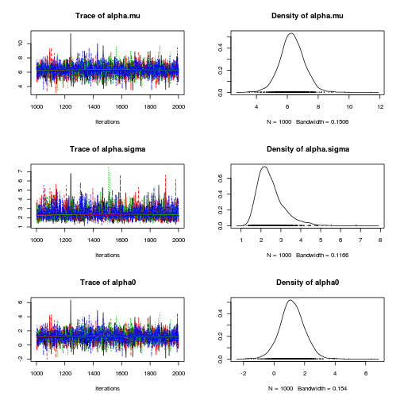
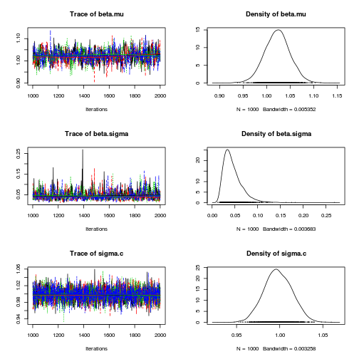

# Varying intercept and slope model

$$latex stay_{ij} = \alpha_i + \beta_i * x_{ij} + e_{ij}$$


# Import packages


```r
rm(list = ls())
library(rjags)
library(coda)
library(lme4)
library(lattice)
```


# Specify and export BUGS model


```r
modelstring <- "
model {
# Model
for (i in 1:length(Y)) {
    mu[i] <- alpha[id.i[i]] + beta[id.i[i]] * (X[i] - x.bar);
    Y[i]   ~ dnorm(mu[i], tau.c)
}

for (j in 1:J) {    
    alpha[j] ~ dnorm(alpha.mu, alpha.tau);
    beta[j] ~ dnorm(beta.mu, beta.tau);
}

# Priors
alpha.mu  ~ dnorm(0, 1.0E-4);
beta.mu   ~ dnorm(0, 1.0E-4);
tau.c     ~ dgamma(1.0E-3, 1.0E-3);
alpha.tau ~ dgamma(1.0E-3, 1.0E-3);
beta.tau ~ dgamma(1.0E-3, 1.0E-3);

# Transformations
alpha.sigma  <- 1.0/sqrt(alpha.tau);
beta.sigma  <- 1.0/sqrt(beta.tau);
sigma.c    <- 1.0/sqrt(tau.c);
x.bar    <- mean(X[]);
alpha0   <- alpha.mu - beta.mu*x.bar;
}
"
writeLines(modelstring, "model.txt")
```


# Generate Data


```r
set.seed(4444)
Alpha.Mu <- 2
Alpha.Sigma <- 2
Beta <- 1
Sigma <- 1
J <- 200  # number of observations per case
N <- 10  # number of cases

Data <- expand.grid(id.i = seq(1:N), id.j = seq(1, J))
Data$x <- rnorm(nrow(Data), mean = 5, sd = 1)
Alpha <- rnorm(N, Alpha.Mu, Alpha.Sigma)
Data$alpha <- Alpha[Data$id.i]
Data$error <- rnorm(nrow(Data), 0, Sigma)
Data$yhat <- Data$alpha + Beta * Data$x
Data$y <- Data$yhat + Data$error

# Convert data to input format required by JAGS
jagsdata <- list(X = Data$x, Y = Data$y, id.i = Data$id.i, J = length(unique(Data$id.i)))
```


# Bayesian analysis


```r
mod1 <- jags.model("model.txt", data = jagsdata, n.chains = 4, n.adapt = 1000)
```


```
## Compiling model graph
##    Resolving undeclared variables
##    Allocating nodes
##    Graph Size: 12040
## 
## Initializing model
## 
```


```r
update(mod1, 1000)  # burn in

# monitor
mod1.samples <- coda.samples(model = mod1, variable.names = c("alpha.mu", 
    "alpha.sigma", "beta.mu", "beta.sigma", "alpha0", "sigma.c"), n.iter = 1000)

# Model summary and diagnostics
plot(mod1.samples)  # plot trace and posterior density for each parameter
```

  

```r
summary(mod1.samples)  # print descriptive statistics of posterior densities for parameters
```


```
## 
## Iterations = 1001:2000
## Thinning interval = 1 
## Number of chains = 4 
## Sample size per chain = 1000 
## 
## 1. Empirical mean and standard deviation for each variable,
##    plus standard error of the mean:
## 
##               Mean     SD Naive SE Time-series SE
## alpha.mu    6.3121 0.8078 0.012772       0.011432
## alpha.sigma 2.4830 0.6787 0.010732       0.012426
## alpha0      1.1868 0.8212 0.012984       0.012603
## beta.mu     1.0227 0.0270 0.000427       0.001161
## beta.sigma  0.0453 0.0210 0.000332       0.000767
## sigma.c     0.9981 0.0161 0.000255       0.000269
## 
## 2. Quantiles for each variable:
## 
##               2.5%    25%    50%    75%  97.5%
## alpha.mu     4.727 5.8071 6.2977 6.8071 7.8866
## alpha.sigma  1.555 2.0145 2.3405 2.7889 4.1838
## alpha0      -0.405 0.6731 1.1729 1.6957 2.7867
## beta.mu      0.970 1.0047 1.0228 1.0403 1.0755
## beta.sigma   0.019 0.0307 0.0405 0.0551 0.0971
## sigma.c      0.967 0.9871 0.9976 1.0091 1.0294
## 
```


```r

# Check model predictions mu.samples <- coda.samples(model=mod1,
# variable.names=c('mu'), n.iter=100) mu.means <- summary(mu.samples) #
# print descriptive statistics of posterior densities for parameters
# plot(mu.means$statistics[,1], Data$y - mu.means$statistics[,1],
# xlab='Predicted', ylab='Resid')
```


