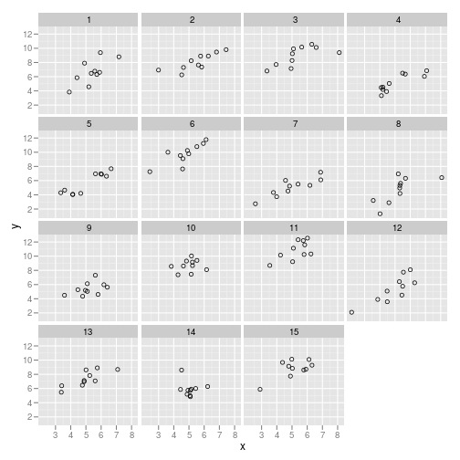
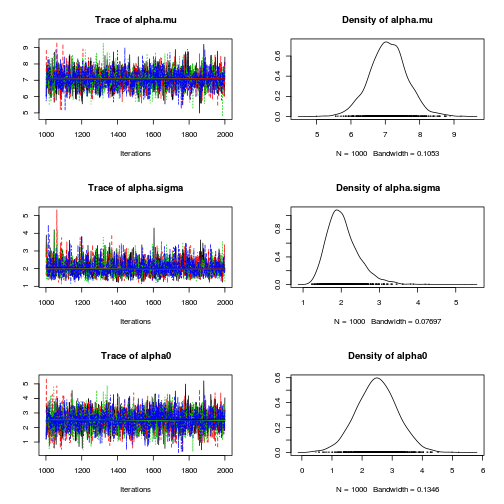
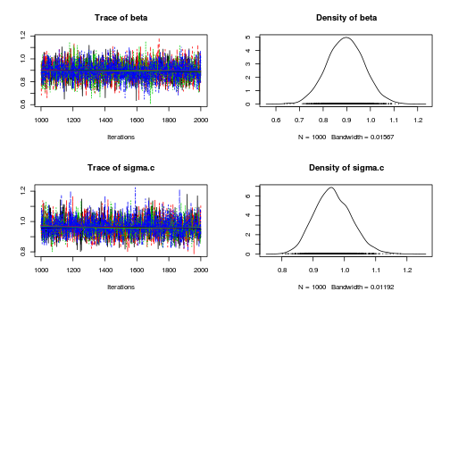

Basic varying intercept multilevel model

$$ y_{ij} = \alpha_i + \beta * x_{ij} + \epsilon$$

where 

$$\epsilon \sim N(0, \sigma^2)$$
and
$$\alpha_i \sim N(\mu_{\alpha}, \sigma^2_{\alpha})$$.

# Import packages


```r
rm(list = ls())
library(rjags)
library(coda)
library(ggplot2)
```


# Specify and export BUGS model


```r
modelstring <- "
model {
    # Model
    for (i in 1:N) {
        mu[i] <- alpha[id.i[i]] + beta * (X[i] - x.bar);
        Y[i]   ~ dnorm(mu[i], tau.c)
    }

    for (i in 1:I) {    
        alpha[i] ~ dnorm(alpha.mu, alpha.tau);
    }

    # Priors
    beta      ~ dnorm(0, 1.0E-4);
    alpha.mu  ~ dnorm(0, 1.0E-4);    
    tau.c     ~ dgamma(1.0E-3, 1.0E-3);
    alpha.tau ~ dgamma(1.0E-3, 1.0E-3);

    # Transformations
    alpha.sigma  <- 1.0/sqrt(alpha.tau);
    sigma.c    <- 1.0/sqrt(tau.c);
    x.bar    <- mean(X[]);
    alpha0   <- alpha.mu - beta*x.bar;
}
"

writeLines(modelstring, "model.txt")
```


# Generate Data


```r
set.seed(4444)
Alpha.Mu <- 2
Alpha.Sigma <- 2
Beta <- 1
Sigma <- 1
J <- 10
N <- 15

Data <- expand.grid(id.i = seq(1:N), id.j = seq(1, J))
Data$x <- rnorm(nrow(Data), mean = 5, sd = 1)
Alpha <- rnorm(N, Alpha.Mu, Alpha.Sigma)
Data$alpha <- Alpha[Data$id.i]
Data$error <- rnorm(nrow(Data), 0, Sigma)
Data$yhat <- Data$alpha + Beta * Data$x
Data$y <- Data$yhat + Data$error

# Convert data to input format required by JAGS
jagsdata <- list(X = Data$x, Y = Data$y, id.i = Data$id.i, N = nrow(Data), 
    I = length(unique(Data$id.i)))
```


# Examine data


```r
ggplot(Data, aes(x, y)) + geom_point(shape = 1) + facet_wrap(~id.i)
```

 


# Bayesian analysis


```r
mod1 <- jags.model("model.txt", data = jagsdata, n.chains = 4, n.adapt = 1000)
```


```
## Compiling model graph
##    Resolving undeclared variables
##    Allocating nodes
##    Graph Size: 933
## 
## Initializing model
## 
```


```r
update(mod1, 1000)  # burn in
mod1.samples <- coda.samples(model = mod1, variable.names = c("alpha.mu", 
    "alpha.sigma", "beta", "alpha0", "sigma.c"), n.iter = 1000)
```


# Model summary and diagnostics


```r
plot(mod1.samples)  # plot trace and posterior density for each parameter
```

  

```r

summary(mod1.samples)  # print descriptive statistics of posterior densities for parameters
```


```
## 
## Iterations = 1001:2000
## Thinning interval = 1 
## Number of chains = 4 
## Sample size per chain = 1000 
## 
## 1. Empirical mean and standard deviation for each variable,
##    plus standard error of the mean:
## 
##              Mean     SD Naive SE Time-series SE
## alpha.mu    7.089 0.5551 0.008776        0.01027
## alpha.sigma 2.046 0.4237 0.006700        0.00723
## alpha0      2.496 0.6816 0.010777        0.01212
## beta        0.895 0.0777 0.001228        0.00115
## sigma.c     0.964 0.0591 0.000934        0.00110
## 
## 2. Quantiles for each variable:
## 
##              2.5%   25%   50%   75% 97.5%
## alpha.mu    6.002 6.733 7.082 7.433  8.18
## alpha.sigma 1.393 1.754 1.988 2.265  3.08
## alpha0      1.141 2.049 2.496 2.943  3.82
## beta        0.742 0.842 0.894 0.948  1.05
## sigma.c     0.858 0.923 0.961 1.003  1.09
## 
```


