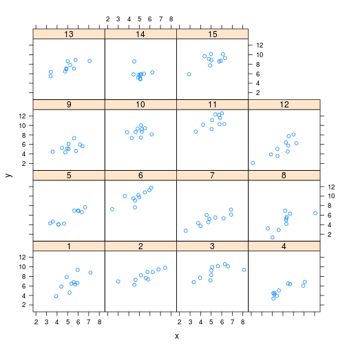
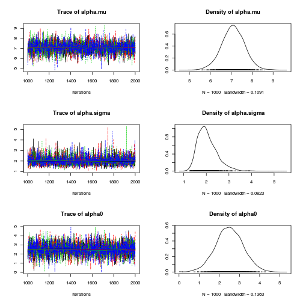

# Basic varying intercept multilevel model

$$y_{ij} = \alpha_i + \beta * x_{ij} + e_{ij}$$


# Import packages


```r
rm(list = ls())
library(rjags)
library(coda)
library(lattice)
```


# Specify and export BUGS model


```r
modelstring <- "
model {
    # Model
    for (i in 1:N) {
        for (j in 1:J) {
            mu[i,j] <- alpha[i] + beta * (X[i,j] - x.bar);
            Y[i,j]   ~ dnorm(mu[i, j], tau.c)
        }
        alpha[i] ~ dnorm(alpha.mu, alpha.tau);
    }

    # Priors
    beta      ~ dnorm(0, 1.0E-4);
    alpha.mu  ~ dnorm(0, 1.0E-4);    
    tau.c     ~ dgamma(1.0E-3, 1.0E-3);
    alpha.tau ~ dgamma(1.0E-3, 1.0E-3);

    # Transformations
    alpha.sigma  <- 1.0/sqrt(alpha.tau);
    sigma.c    <- 1.0/sqrt(tau.c);
    x.bar    <- mean(X[,]);
    alpha0   <- alpha.mu - beta*x.bar;
}
"
writeLines(modelstring, "model.txt")
```


# Generate Data


```r
set.seed(4444)
Alpha.Mu <- 2
Alpha.Sigma <- 2
Beta <- 1
Sigma <- 1
J <- 10
N <- 15

Data <- expand.grid(id.i = seq(1:N), id.j = seq(1, J))
Data$x <- rnorm(nrow(Data), mean = 5, sd = 1)
Alpha <- rnorm(N, Alpha.Mu, Alpha.Sigma)
Data$alpha <- Alpha[Data$id.i]
Data$error <- rnorm(nrow(Data), 0, Sigma)
Data$yhat <- Data$alpha + Beta * Data$x
Data$y <- Data$yhat + Data$error


# Convert data to input format required by JAGS

Data.wide.x <- reshape(Data[, c("id.i", "id.j", "x")], idvar = "id.i", 
    timevar = "id.j", direction = "wide")
Data.wide.x$id.i <- NULL
Data.wide.y <- reshape(Data[, c("id.i", "id.j", "y")], idvar = "id.i", 
    timevar = "id.j", direction = "wide")
Data.wide.y$id.i <- NULL

jagsdata <- list(X = as.matrix(Data.wide.x), Y = as.matrix(Data.wide.y), 
    N = N, J = J)
```


# Traditional analysis


```r
xyplot(y ~ x | factor(id.i), Data)
```

 

```r
lm(y ~ x * factor(id.i), Data)
```


```
## 
## Call:
## lm(formula = y ~ x * factor(id.i), data = Data)
## 
## Coefficients:
##      (Intercept)                 x     factor(id.i)2     factor(id.i)3  
##          -0.7655            1.3721            4.6329            6.0347  
##    factor(id.i)4     factor(id.i)5     factor(id.i)6     factor(id.i)7  
##           1.2494            0.7125            5.5118            1.7958  
##    factor(id.i)8     factor(id.i)9    factor(id.i)10    factor(id.i)11  
##           0.0375            3.5726            8.3078            6.3176  
##   factor(id.i)12    factor(id.i)13    factor(id.i)14    factor(id.i)15  
##          -0.2325            3.9811            8.6667            5.4271  
##  x:factor(id.i)2   x:factor(id.i)3   x:factor(id.i)4   x:factor(id.i)5  
##          -0.6059           -0.6932           -0.4590           -0.2453  
##  x:factor(id.i)6   x:factor(id.i)7   x:factor(id.i)8   x:factor(id.i)9  
##          -0.3131           -0.5609           -0.3327           -0.8731  
## x:factor(id.i)10  x:factor(id.i)11  x:factor(id.i)12  x:factor(id.i)13  
##          -1.1463           -0.3737           -0.0786           -0.5448  
## x:factor(id.i)14  x:factor(id.i)15  
##          -1.7619           -0.5601  
## 
```


```r

fits <- NULL
for (i in unique(Data$id.i)) {
    fits[[i]] <- lm(y ~ x, Data[Data$id.i == i, ])
    names(fits)[i] <- paste(i)
}

coefs <- sapply(fits, coef)
rownames(coefs) <- c("alpha", "beta")
summary(coefs["alpha", ])
```


```
##    Min. 1st Qu.  Median    Mean 3rd Qu.    Max. 
##  -0.998   0.215   3.220   2.970   5.010   7.900 
```


```r
sd(coefs["alpha", ])
```


```
## [1] 3.006
```


```r
summary(coefs["beta", ])
```


```
##    Min. 1st Qu.  Median    Mean 3rd Qu.    Max. 
##  -0.390   0.723   0.827   0.802   1.050   1.370 
```


# Bayesian analysis


```r
mod1 <- jags.model("model.txt", data = jagsdata, n.chains = 4, n.adapt = 1000)
```


```
## Compiling model graph
##    Resolving undeclared variables
##    Allocating nodes
##    Graph Size: 783
## 
## Initializing model
## 
```


```r
update(mod1, 1000)  # burn in

# monitor
mod1.samples <- coda.samples(model = mod1, variable.names = c("alpha.mu", 
    "alpha.sigma", "beta", "alpha0", "sigma.c"), n.iter = 1000)

# Model summary and diagnostics
plot(mod1.samples)  # plot trace and posterior density for each parameter
```

  

```r
summary(mod1.samples)  # print descriptive statistics of posterior densities for parameters
```


```
## 
## Iterations = 1001:2000
## Thinning interval = 1 
## Number of chains = 4 
## Sample size per chain = 1000 
## 
## 1. Empirical mean and standard deviation for each variable,
##    plus standard error of the mean:
## 
##              Mean     SD Naive SE Time-series SE
## alpha.mu    7.088 0.5501 0.008699        0.00889
## alpha.sigma 2.044 0.4346 0.006872        0.00736
## alpha0      2.500 0.6824 0.010790        0.01151
## beta        0.894 0.0778 0.001230        0.00132
## sigma.c     0.965 0.0591 0.000935        0.00112
## 
## 2. Quantiles for each variable:
## 
##              2.5%   25%   50%   75% 97.5%
## alpha.mu    5.976 6.728 7.091 7.453  8.17
## alpha.sigma 1.404 1.735 1.972 2.282  3.07
## alpha0      1.155 2.051 2.494 2.956  3.86
## beta        0.744 0.841 0.894 0.947  1.05
## sigma.c     0.856 0.924 0.962 1.003  1.09
## 
```


