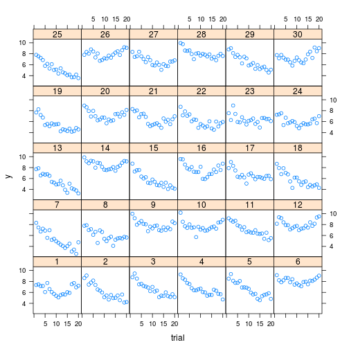
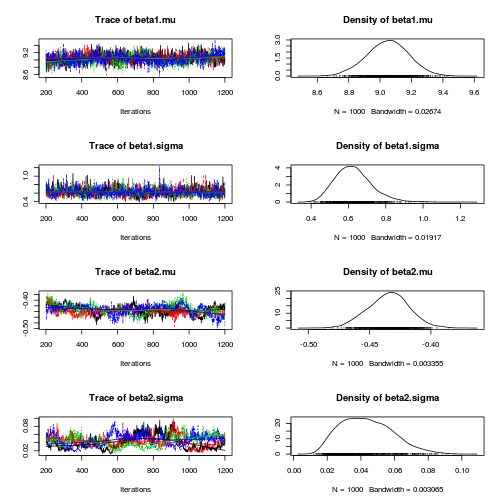
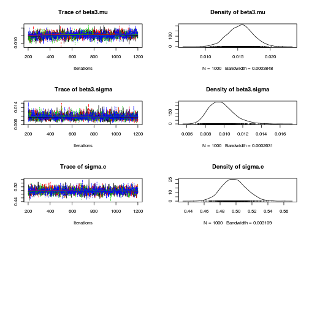
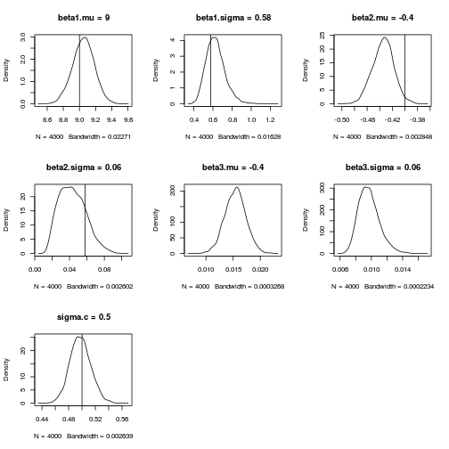

# Skill acquisition example
Data is

* y: is reaction time
* x: is trial number 1 to J for subject 1 to N

Data is simulated from a quadratic model

# Import packages


```r
rm(list = ls())
library(rjags)
library(coda)
library(lattice)
```


# Simulate data


```r
set.seed(1234)
J <- 20  # number of time points per subject
N <- 30  # number of subjects
Sigma <- 0.5  # standard deviation of error

beta1.min <- 8
beta1.max <- 10
beta2.min <- -0.5
beta2.max <- -0.3
beta3.min <- 0.01
beta3.max <- 0.02

beta1.mu <- (beta1.min + beta1.max)/2
beta1.sd <- sqrt(1/12 * (beta1.max - beta1.min)^2)
beta2.mu <- (beta2.min + beta2.max)/2
beta2.sd <- sqrt(1/12 * (beta2.max - beta2.min)^2)
beta3.mu <- (beta3.min + beta3.max)/2
beta3.sd <- sqrt(1/12 * (beta3.max - beta3.min)^2)

# subject level parameters
subjects <- data.frame(subject = seq(N))
subjects$beta1 <- runif(nrow(subjects), beta1.min, beta1.max)
subjects$beta2 <- runif(nrow(subjects), beta2.min, beta2.max)
subjects$beta3 <- runif(nrow(subjects), beta3.min, beta3.max)

Data <- expand.grid(subject = seq(N), trial = seq(J))
Data <- merge(Data, subjects)

Data$yhat <- Data$beta1 + Data$beta2 * Data$trial + Data$beta3 * 
    Data$trial^2
Data$error <- rnorm(nrow(Data), 0, Sigma)  # naive model of error; permits negative rt
Data$y <- Data$yhat + Data$error

min(Data$y)  # check whether particular sample has negative rt
```


```
## [1] 2.64
```


```r


# Convert data to input format required by JAGS
jagsdata <- list(subject = Data$subject, trial = Data$trial, y = Data$y, 
    N = N)
```


# traditional analysis


```r
xyplot(y ~ trial | factor(subject), Data)
```

 

```r

DataSplit <- split(Data, Data$subject)
nlsfits <- lapply(DataSplit, function(X) nls(y ~ beta1 + beta2 * 
    trial + beta3 * trial^2, X, start = list(beta1 = 7, beta2 = -0.4, beta3 = 0.02)))
nlscoefs <- sapply(nlsfits, coef)
apply(nlscoefs, 1, function(X) c(mean = mean(X), sd = sd(X)))
```


```
##       beta1    beta2    beta3
## mean 9.0487 -0.43414 0.015399
## sd   0.6798  0.08175 0.005493
```


```r

nlscoefs <- sapply(nlsfits, coef)
nlssds <- sapply(nlsfits, function(X) sqrt(deviance(X)/(N - 1)))
nlsall <- rbind(nlscoefs, sd = nlssds)
apply(nlsall, 1, function(X) c(mean = mean(X), sd = sd(X)))
```


```
##       beta1    beta2    beta3      sd
## mean 9.0487 -0.43414 0.015399 0.37688
## sd   0.6798  0.08175 0.005493 0.06481
```


# Specify JAGS model


```r
jags.script <- "
model {
# Model
for (i in 1:length(y)) {
    mu[i] <- beta1[subject[i]] + beta2[subject[i]] * trial[i] +
        beta3[subject[i]] * trial[i] ^ 2;
    y[i]  ~ dnorm(mu[i], tau.c)
}

# Random coefficients
for (i in 1:N) {    
    beta1[i] ~ dnorm(beta1.mu, beta1.tau);
    beta2[i] ~ dnorm(beta2.mu, beta2.tau);
    beta3[i] ~ dnorm(beta3.mu, beta3.tau);
}

# Priors
beta1.mu  ~ dnorm(0, 1.0E-4);
beta2.mu   ~ dnorm(0, 1.0E-4);
beta3.mu   ~ dnorm(0, 1.0E-4);
tau.c     ~ dgamma(1.0E-3, 1.0E-3);
beta1.tau ~ dgamma(1.0E-3, 1.0E-3);
beta2.tau ~ dgamma(1.0E-3, 1.0E-3);
beta3.tau ~ dgamma(1.0E-3, 1.0E-3);

# Transformations
beta1.sigma  <- 1.0/sqrt(beta1.tau);
beta2.sigma  <- 1.0/sqrt(beta2.tau);
beta3.sigma  <- 1.0/sqrt(beta3.tau);
sigma.c    <- 1.0/sqrt(tau.c);
}
"
```


# Bayesian analysis


```r
mod1 <- jags.model(textConnection(jags.script), data = jagsdata, 
    n.chains = 4, n.adapt = 1000)
```


```
## Compiling model graph
##    Resolving undeclared variables
##    Allocating nodes
##    Graph Size: 3731
## 
## Initializing model
## 
```


```r
update(mod1, 200)  # burn in

# monitor
mod1.samples <- coda.samples(model = mod1, variable.names = c("beta1.mu", 
    "beta1.sigma", "beta2.mu", "beta2.sigma", "beta3.mu", "beta3.sigma", "sigma.c"), 
    n.iter = 1000)

# Model summary and diagnostics
plot(mod1.samples)  # plot trace and posterior density for each parameter
```

  

```r
summary(mod1.samples)  # print descriptive statistics of posterior densities for parameters
```


```
## Warning message: glm.fit: algorithm did not converge
```


```
## Warning message: glm.fit: algorithm did not converge
```


```
## Warning message: glm.fit: algorithm did not converge
```


```
## 
## Iterations = 201:1200
## Thinning interval = 1 
## Number of chains = 4 
## Sample size per chain = 1000 
## 
## 1. Empirical mean and standard deviation for each variable,
##    plus standard error of the mean:
## 
##                 Mean      SD Naive SE Time-series SE
## beta1.mu     9.04862 0.13304 2.10e-03       4.14e-03
## beta1.sigma  0.62709 0.09789 1.55e-03       2.98e-03
## beta2.mu    -0.43459 0.01691 2.67e-04       9.21e-04
## beta2.sigma  0.04348 0.01519 2.40e-04       8.67e-04
## beta3.mu     0.01540 0.00192 3.04e-05       5.04e-05
## beta3.sigma  0.00971 0.00133 2.11e-05       2.24e-05
## sigma.c      0.49762 0.01545 2.44e-04       3.03e-04
## 
## 2. Quantiles for each variable:
## 
##                 2.5%      25%      50%     75%   97.5%
## beta1.mu     8.77950  8.96080  9.05217  9.1384  9.3050
## beta1.sigma  0.46048  0.55799  0.61929  0.6853  0.8459
## beta2.mu    -0.46841 -0.44563 -0.43395 -0.4234 -0.4020
## beta2.sigma  0.01882  0.03160  0.04230  0.0539  0.0760
## beta3.mu     0.01156  0.01411  0.01545  0.0167  0.0192
## beta3.sigma  0.00752  0.00876  0.00959  0.0105  0.0127
## sigma.c      0.46813  0.48692  0.49715  0.5076  0.5287
## 
```


```r
plotTrueAndPosterior <- function(jags.samples, variable.name, true.value) {
    # this hasn't been tested on a range of inputs
    plot(density(as.vector(sapply(jags.samples, function(X) X[, variable.name]))), 
        main = paste(variable.name, "=", round(true.value, 2)))
    abline(v = true.value)
}
par(mfrow = c(3, 3))
plotTrueAndPosterior(mod1.samples, "beta1.mu", beta1.mu)
plotTrueAndPosterior(mod1.samples, "beta1.sigma", beta1.sd)
plotTrueAndPosterior(mod1.samples, "beta2.mu", beta2.mu)
plotTrueAndPosterior(mod1.samples, "beta2.sigma", beta2.sd)
plotTrueAndPosterior(mod1.samples, "beta3.mu", beta2.mu)
plotTrueAndPosterior(mod1.samples, "beta3.sigma", beta2.sd)
plotTrueAndPosterior(mod1.samples, "sigma.c", Sigma)
```

 


