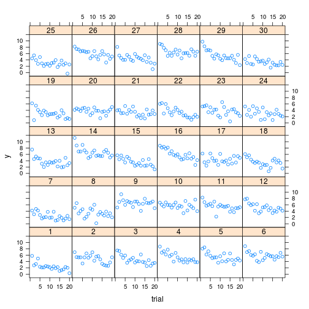
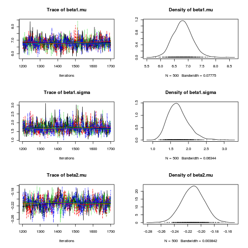
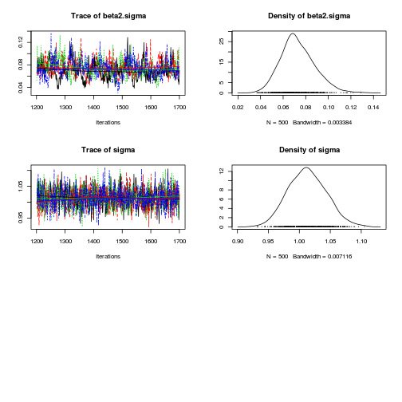
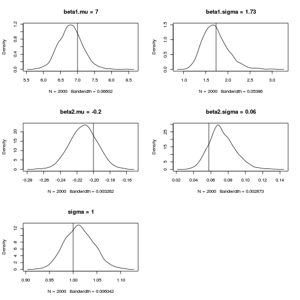

This represents a rough approximation of the model underlyind individual differences in performance with practice, where task performance is measured as task completion time in seconds.

Data $latex y_{ij}$ is task completion time for the $latex i$th trial, $latex i=1, \ldots, N$, and the $latex j$ th participant, $latex j=1, \ldots, J$.

Data is drawn from a two parameter power model where both parameters vary between participants.

$latex y_{ij} \sim N(\beta_{1i}x_i^{\beta_{2i}}, \sigma^2)$
$latex \beta_1i \sim \text{Unif}( 4, 10)$
$latex \beta_2i \sim \text{Unif}(-0.3, -0.1)$


# Import packages


```r
rm(list = ls())
library(rjags)
library(coda)
library(lattice)
set.seed(1234)
```


# Simulate data


```r
J <- 20  # number of time points per subject
N <- 30  # number of subjects
Sigma <- 1  # standard deviation of error
beta1.min <- 4
beta1.max <- 10
beta2.min <- -0.3
beta2.max <- -0.1

# True values of parameters of interest
beta1.mean <- (beta1.max + beta1.min)/2
beta2.mean <- (beta2.max + beta2.min)/2
beta1.sd <- sqrt(1/12 * (beta1.max - beta1.min)^2)
beta2.sd <- sqrt(1/12 * (beta2.max - beta2.min)^2)

# subject level parameters
subjects <- data.frame(subject = seq(N))
subjects$beta1 <- runif(nrow(subjects), beta1.min, beta1.max)
subjects$beta2 <- runif(nrow(subjects), beta2.min, beta2.max)

Data <- expand.grid(subject = seq(N), trial = seq(J))
Data <- merge(Data, subjects)

Data$yhat <- Data$beta1 * Data$trial^Data$beta2
# naive model of error; permits negative rt
Data$error <- rnorm(nrow(Data), 0, Sigma)
Data$y <- Data$yhat + Data$error

# check whether particular sample has negative rt min(Data$y)

# Convert data to input format required by JAGS
jagsdata <- list(subject = Data$subject, trial = Data$trial, y = Data$y, 
    N = N)
```


# Traditional analysis


```r
xyplot(y ~ trial | factor(subject), Data)
```

 


* The lattice plot shows the relationship between trial and task completion time for each simulated participant.


```r
DataSplit <- split(Data, Data$subject)
nlsfits <- lapply(DataSplit, function(X) nls(y ~ beta1 * trial^beta2, 
    X, start = list(beta1 = 7, beta2 = -0.2)))
nlscoefs <- sapply(nlsfits, coef)
nlssds <- sapply(nlsfits, function(X) sqrt(deviance(X)/(N - 1)))
nlsall <- rbind(nlscoefs, sd = nlssds)
sample.values <- round(apply(nlsall, 1, function(X) c(mean = mean(X), 
    sd = sd(X))), 2)

true.values <- round(data.frame(beta1 = c(beta1.mean, beta1.sd), 
    beta2 = c(beta2.mean, beta2.sd), sd = c(Sigma, 0)), 2)
row.names(true.values) <- c("mean", "sd")

sample.values
```


```
##      beta1 beta2   sd
## mean  6.82 -0.21 0.79
## sd    1.80  0.09 0.13
```


```r
true.values
```


```
##      beta1 beta2 sd
## mean  7.00 -0.20  1
## sd    1.73  0.06  0
```


* The above code compares the sample estimates of parameters with true values.


# Export BUGS model


```r
m1.jags <- "
model {
    # Model
    for (i in 1:length(y)) {
        mu[i] <- beta1[subject[i]] * pow(trial[i], beta2[subject[i]]);
        y[i]  ~ dnorm(mu[i], tau)
    }

    # Random coefficients
    for (i in 1:N) {    
        beta1[i] ~ dnorm(beta1.mu, beta1.tau);
        beta2[i] ~ dnorm(beta2.mu, beta2.tau);
    }

    # Priors
    beta1.mu  ~ dnorm(0, 1.0E-4);
    beta2.mu   ~ dnorm(0, 1.0E-4);
    tau     ~ dgamma(1.0E-3, 1.0E-3);
    beta1.tau ~ dgamma(1.0E-3, 1.0E-3);
    beta2.tau ~ dgamma(1.0E-3, 1.0E-3);

    # Transformations
    beta1.sigma  <- 1.0/sqrt(beta1.tau);
    beta2.sigma  <- 1.0/sqrt(beta2.tau);
    sigma    <- 1.0/sqrt(tau);
}
"
```


# Bayesian analysis


```r
mod1 <- jags.model(textConnection(m1.jags), data = jagsdata, n.chains = 4, 
    n.adapt = 1000)
```


```
## Compiling model graph
##    Resolving undeclared variables
##    Allocating nodes
##    Graph Size: 3076
## 
## Initializing model
## 
```


```r
update(mod1, 200)  # burn in
mod1.samples <- coda.samples(model = mod1, variable.names = c("beta1.mu", 
    "beta1.sigma", "beta2.mu", "beta2.sigma", "sigma"), n.iter = 500)
plot(mod1.samples)  # plot trace and posterior density for each parameter
```

  

```r
summary(mod1.samples)  # print descriptive statistics of posterior densities for parameters
```


```
## 
## Iterations = 1201:1700
## Thinning interval = 1 
## Number of chains = 4 
## Sample size per chain = 500 
## 
## 1. Empirical mean and standard deviation for each variable,
##    plus standard error of the mean:
## 
##                Mean     SD Naive SE Time-series SE
## beta1.mu     6.7995 0.3475 0.007769       0.011890
## beta1.sigma  1.7163 0.2859 0.006393       0.010689
## beta2.mu    -0.2120 0.0168 0.000376       0.000756
## beta2.sigma  0.0731 0.0151 0.000338       0.000800
## sigma        1.0129 0.0307 0.000686       0.000817
## 
## 2. Quantiles for each variable:
## 
##                2.5%     25%     50%     75%  97.5%
## beta1.mu     6.1465  6.5709  6.7940  7.0204  7.513
## beta1.sigma  1.2550  1.5156  1.6841  1.8824  2.360
## beta2.mu    -0.2446 -0.2231 -0.2118 -0.2009 -0.179
## beta2.sigma  0.0471  0.0627  0.0713  0.0823  0.106
## sigma        0.9562  0.9911  1.0122  1.0333  1.075
## 
```


## Comparison with true values


```r
plotTrueAndPosterior <- function(jags.samples, variable.name, true.value) {
    # this hasn't been tested on a range of inputs
    plot(density(as.vector(sapply(jags.samples, function(X) X[, variable.name]))), 
        main = paste(variable.name, "=", round(true.value, 2)))
    abline(v = true.value)
}
par(mfrow = c(3, 2))
plotTrueAndPosterior(mod1.samples, "beta1.mu", beta1.mean)
plotTrueAndPosterior(mod1.samples, "beta1.sigma", beta1.sd)
plotTrueAndPosterior(mod1.samples, "beta2.mu", beta2.mean)
plotTrueAndPosterior(mod1.samples, "beta2.sigma", beta2.sd)
plotTrueAndPosterior(mod1.samples, "sigma", Sigma)
```

 


* These plots show the posterior density for each parameter with a vertical line indicating the true value of the simulation.
* In each case the true value is well contained within credible regiong of the posterior density. 

## Exploring parameter correlations


```r
(autocorrs <- round(autocorr(mod1.samples[[1]])["Lag 0", , ], 2))
```


```
##             beta1.mu beta1.sigma beta2.mu beta2.sigma sigma
## beta1.mu        1.00       -0.04    -0.14        0.01  0.02
## beta1.sigma    -0.04        1.00     0.01       -0.15  0.03
## beta2.mu       -0.14        0.01     1.00       -0.04 -0.07
## beta2.sigma     0.01       -0.15    -0.04        1.00 -0.04
## sigma           0.02        0.03    -0.07       -0.04  1.00
```


```r
plot(as.matrix(mod1.samples[[1]][, c("beta1.mu", "beta2.mu")]))
```

 


* The largest absolute correlation between parameters was `-0.14`  between $latex \beta_{1\mu}$ and $latex \beta_{2\mu}$.


```r
lag1.cor <- autocorr(mod1.samples[[1]])["Lag 1", , ]
round(diag(lag1.cor), 2)
```


```
##    beta1.mu beta1.sigma    beta2.mu beta2.sigma       sigma 
##        0.08        0.33        0.33        0.61        0.11 
```


```r
lag50.cor <- round(autocorr(mod1.samples[[1]])["Lag 50", , ], 2)
round(diag(lag50.cor), 2)
```


```
##    beta1.mu beta1.sigma    beta2.mu beta2.sigma       sigma 
##       -0.06        0.08        0.02       -0.14        0.05 
```


* The lag 1 correlation of parameters is moderate, but presumably not too problematic.
* Ultimately the auto-correlations do appear to be tending to zero.


