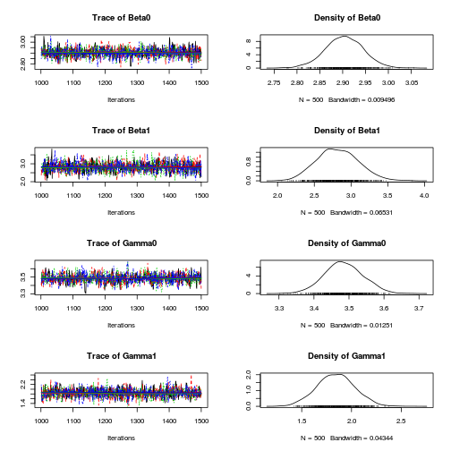
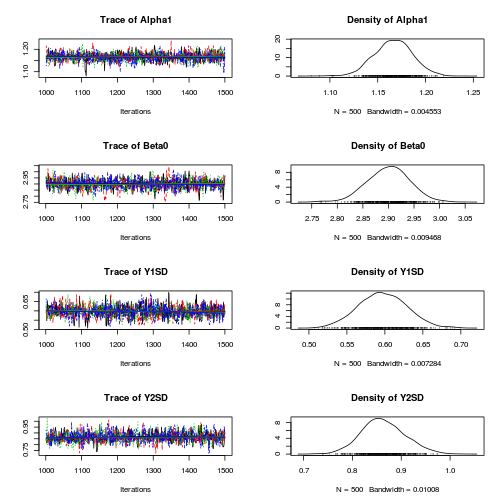
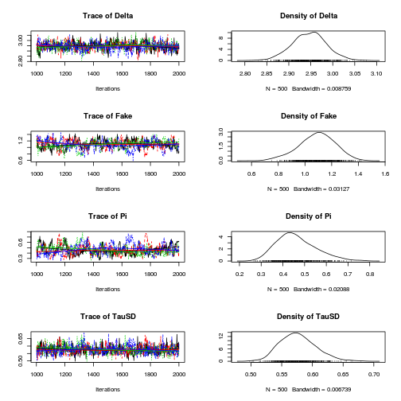
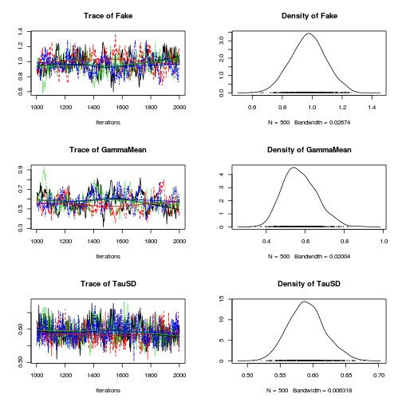
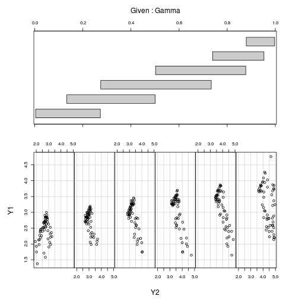
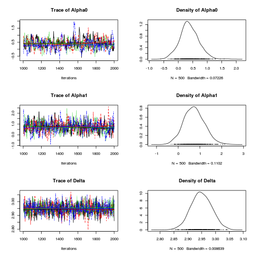
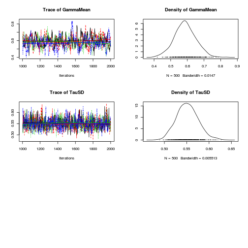

# Import packages


```r
rm(list = ls())
library(rjags)
library(coda)
library(psych)
```


# Get data


```r
# Generate Data
N <- 200  # sample size
Tausq <- 0.6^2  # true variance
Sigmasq <- 0.1^2  # measurement variance

Delta <- 3  # mean true honest score
MaxScore <- 5

Alpha0 <- 3
Alpha1 <- -1

Eta <- rnorm(n = N, 0, sd = sqrt(Tausq))  # True centred-score
E <- rnorm(n = N, mean = 0, sd = sqrt(Sigmasq))

Mu <- Delta + Eta  # True Honest Score
Mu <- ifelse(Mu >= 4.9, 4.9, Mu)  # Necessary constraint

Y1 <- Mu + E  #Y1 (honest) score

Beta <- runif(N, Mu, MaxScore)  #Y2 (applicant) score if person fakes

logistic <- function(x, alpha0, alpha1) {
    exp(alpha0 + alpha1 * x)/(1 + exp(alpha0 + alpha1 * x))
}

Pi <- logistic(Delta + Eta, Alpha0, Alpha1)  #Probability of fake
Gamma <- rbinom(N, size = 1, Pi)  # Gamma = 1 is fake; Gamma = 0 not fake

Y2 <- Gamma * Beta + (1 - Gamma) * Mu

Data <- data.frame(Y1, Y2, Beta, Pi, Gamma)

# Convert data to input format required by JAGS
jagsdata.Y1Y2 <- list(Y1 = Y1, Y2 = Y2)
```


# Examine data


```r
# simple examination of data
plot(Y2, Y1)
abline(a = 0, b = 1)
```

 


# Fit Jags Models
## M3: Simple Y1Y2

$$y_{1i} \sim N(\beta_0, 1/\beta_1)$$
$$y_{2i} \sim N(\gamma_0, 1/\gamma_1)$$

with priors

$$\beta_0 \sim  Unif(1, 5)$$
$$\beta_1 \sim Unif(0, 100)$$
$$\gamma_0 \sim Unif(1, 5)$$
$$\gamma_1 \sim Unif(0, 100)$$


### JAGS Model


```r
m3.jags <- "
model {
    # Model
    for (i in 1:length(Y1)) {
        Y1[i] ~ dnorm(Beta0, Beta1)
        Y2[i] ~ dnorm(Gamma0, Gamma1)
    }
    Beta0 ~ dunif(1, 5)
	Beta1 ~ dunif(0, 100)

    Gamma0 ~ dunif(1, 5)
	Gamma1 ~ dunif(0, 100)
}
"
```


### Model fitting


```r
mod3 <- jags.model(textConnection(m3.jags), data = jagsdata.Y1Y2, 
    n.chains = 4, n.adapt = 500)
```


```
## Compiling model graph
##    Resolving undeclared variables
##    Allocating nodes
##    Graph Size: 408
## 
## Initializing model
## 
```


```r
update(mod3, 500)  # burn in
mod3.samples <- coda.samples(model = mod3, n.iter = 500, variable.names = c("Beta0", 
    "Beta1", "Gamma0", "Gamma1"))
plot(mod3.samples)
```

 

```r
summary(mod3.samples)
```


```
## 
## Iterations = 1001:1500
## Thinning interval = 1 
## Number of chains = 4 
## Sample size per chain = 500 
## 
## 1. Empirical mean and standard deviation for each variable,
##    plus standard error of the mean:
## 
##        Mean     SD Naive SE Time-series SE
## Beta0  2.90 0.0412 0.000922        0.00110
## Beta1  2.82 0.2818 0.006300        0.00868
## Gamma0 3.49 0.0550 0.001231        0.00183
## Gamma1 1.84 0.1881 0.004207        0.00490
## 
## 2. Quantiles for each variable:
## 
##        2.5%  25%  50%  75% 97.5%
## Beta0  2.82 2.88 2.90 2.93  2.98
## Beta1  2.30 2.63 2.81 3.01  3.39
## Gamma0 3.38 3.45 3.48 3.52  3.59
## Gamma1 1.47 1.72 1.84 1.97  2.21
## 
```


## M4: Correlated Y1 Y2

And the model is: 

$y_{1i} \sim N(\beta_0, 1/\beta_1)$
$y_{2i} \sim N(\alpha_1 Y_{1i}, 1/\gamma_1)$

With priors:

$\beta_0 \sim Unif(1, 5)$
$\beta_1 \sim Unif(0, 100)$
$\alpha_1 \sim Unif(0, 10)$
$\alpha_1 \sim Unif(0, 100)$


### JAGS Model


```r
m4.jags <- "
model {
    # Model
    for (i in 1:length(Y2)) {
        Y1[i] ~ dnorm(Beta0, Beta1)
        Y2[i] ~ dnorm(Eta[i], Gamma1)
        Eta[i] <- Alpha1 * Y1[i]
    }

    Beta0 ~ dunif(1, 5)
	Beta1 ~ dunif(0, 100)

    Alpha1 ~ dunif(0, 10)
	Gamma1 ~ dunif(0, 100)

    Y1SD <- Beta1 ^(-0.5)
    Y2SD <- Gamma1 ^(-0.5)
}
"
```


### Model fitting


```r
mod4 <- jags.model(textConnection(m4.jags), data = jagsdata.Y1Y2, 
    n.chains = 4, n.adapt = 500)
```


```
## Compiling model graph
##    Resolving undeclared variables
##    Allocating nodes
##    Graph Size: 613
## 
## Initializing model
## 
```


```r
update(mod4, 500)  # burn in
mod4.samples <- coda.samples(model = mod4, n.iter = 500, variable.names = c("Beta0", 
    "Y1SD", "Alpha1", "Y2SD"))
plot(mod4.samples)
```

 

```r
summary(mod4.samples)
```


```
## 
## Iterations = 1001:1500
## Thinning interval = 1 
## Number of chains = 4 
## Sample size per chain = 500 
## 
## 1. Empirical mean and standard deviation for each variable,
##    plus standard error of the mean:
## 
##         Mean     SD Naive SE Time-series SE
## Alpha1 1.166 0.0199 0.000444       0.000553
## Beta0  2.900 0.0415 0.000927       0.001262
## Y1SD   0.597 0.0314 0.000703       0.000940
## Y2SD   0.863 0.0445 0.000994       0.001374
## 
## 2. Quantiles for each variable:
## 
##         2.5%   25%   50%   75% 97.5%
## Alpha1 1.127 1.153 1.167 1.180 1.204
## Beta0  2.819 2.873 2.902 2.928 2.979
## Y1SD   0.536 0.575 0.597 0.619 0.659
## Y2SD   0.780 0.834 0.861 0.892 0.955
## 
```


## M5: Equal means and SDs

The model is:
$y_{1i} \sim N(\beta_0, 1/\beta_1)$
$y_{2i} \sim N(\alpha1 y_{1i}, 1/\gamma_i)$

And priors are:
$\beta_0 \sim Unif(1, 5)$
$\beta_1 \sim Unif(0, 100)$
$\alpha_1 \sim Unif(0, 10)$
$\gamma_1 \sim Unif(0, 100)$


### JAGS Model


```r
m5.jags <- "
model {
    # Model
    for (i in 1:length(Y2)) {
        Y1[i] ~ dnorm(Beta0, Beta1)
        Y2[i] ~ dnorm(Eta[i], Gamma1)
        Eta[i] <- Alpha1 * Y1[i]
    }

	Beta0 ~ dunif(1, 5)
	Beta1 ~ dunif(0, 100)

    Alpha1 ~ dunif(0, 10)
	Gamma1 ~ dunif(0, 100)

    Y1SD <- Beta1 ^(-0.5)
    Y2SD <- Gamma1 ^(-0.5)
}
"
```


### Model fitting


```r
mod5 <- jags.model(textConnection(m5.jags), data = jagsdata.Y1Y2, 
    n.chains = 4, n.adapt = 500)
```


```
## Compiling model graph
##    Resolving undeclared variables
##    Allocating nodes
##    Graph Size: 613
## 
## Initializing model
## 
```


```r
update(mod5, 500)  # burn in
mod5.samples <- coda.samples(model = mod5, n.iter = 500, variable.names = c("Beta0", 
    "Beta1", "Alpha1", "Gamma1", "Y1SD", "Y2SD"))
plot(mod5.samples)
```

  

```r
summary(mod5.samples)
```


```
## 
## Iterations = 1001:1500
## Thinning interval = 1 
## Number of chains = 4 
## Sample size per chain = 500 
## 
## 1. Empirical mean and standard deviation for each variable,
##    plus standard error of the mean:
## 
##         Mean     SD Naive SE Time-series SE
## Alpha1 1.165 0.0201 0.000451       0.000535
## Beta0  2.904 0.0414 0.000927       0.001143
## Beta1  2.789 0.2838 0.006346       0.008565
## Gamma1 1.348 0.1322 0.002957       0.003817
## Y1SD   0.601 0.0309 0.000690       0.000940
## Y2SD   0.864 0.0425 0.000951       0.001231
## 
## 2. Quantiles for each variable:
## 
##         2.5%   25%   50%   75% 97.5%
## Alpha1 1.125 1.152 1.165 1.179 1.206
## Beta0  2.823 2.877 2.904 2.931 2.985
## Beta1  2.246 2.599 2.778 2.975 3.358
## Gamma1 1.104 1.257 1.344 1.433 1.620
## Y1SD   0.546 0.580 0.600 0.620 0.667
## Y2SD   0.786 0.835 0.863 0.892 0.952
## 
```


## DIC example


```r
dic.mod3 <- dic.samples(mod3, 1000, "pD")
```


```
## Warning message: NAs introduced by coercion
```


```r
dic.mod5 <- dic.samples(mod5, 1000, "pD")
```


```
## Warning message: NAs introduced by coercion
```


```r
dic.mod3
```


```
## Mean deviance:  814 
## penalty 5.59 
## Penalized deviance: 819 
```


```r
dic.mod5
```


```
## Mean deviance:  876 
## penalty 4.48 
## Penalized deviance: 881 
```


```r
diffdic(dic.mod3, dic.mod5)
```


```
## Error: incompatible dic objects: variable names differ
```


## M6
### JAGS Model
The model is

$Y_{1i} \sim N(\delta, 1/\tau)$
$Y_{2i} \sim N(\delta + \gamma_i \text{Fake}, 1/\tau)$
$\gamma_i \sim Bern(\pi)$


```r
writeLines("
model {
    # Model
    for (i in 1:length(Y1)) {
        Y1[i] ~ dnorm(Delta, TauPrecision)
        Y2[i] ~ dnorm(Delta + Gamma[i] * Fake, TauPrecision)
        Gamma[i] ~ dbern(Pi)
    }

    # Priors
    # Delta ~ dnorm(1, 5)
    # Alpha0 ~ dnorm(0, 10)
    #Alpha1 ~ dnorm(0, 10)

    Delta ~ dunif(1, 5)
    Fake ~ dunif(0, 2)
    TauPrecision ~ dgamma(1.0E-3, 1.0E-3);
    Pi ~ dunif(0, 1)
    TauSD <- TauPrecision ^ -0.5
}
"
, "m6.jags")
```


### Model fitting


```r
mod6 <- jags.model("m6.jags", data = jagsdata.Y1Y2, n.chains = 4, 
    n.adapt = 500)
```


```
## Compiling model graph
##    Resolving undeclared variables
##    Allocating nodes
##    Graph Size: 1012
## 
## Initializing model
## 
```


```r
update(mod6, 500)  # burn in
mod6.samples <- coda.samples(model = mod6, n.iter = 1000, thin = 2, 
    variable.names = c("TauSD", "Delta", "Fake", "Pi"))
plot(mod6.samples)
```

 

```r
summary(mod6.samples)
```


```
## 
## Iterations = 1002:2000
## Thinning interval = 2 
## Number of chains = 4 
## Sample size per chain = 500 
## 
## 1. Empirical mean and standard deviation for each variable,
##    plus standard error of the mean:
## 
##        Mean     SD Naive SE Time-series SE
## Delta 2.946 0.0391 0.000873        0.00177
## Fake  1.089 0.1363 0.003048        0.00852
## Pi    0.462 0.0910 0.002035        0.00605
## TauSD 0.577 0.0294 0.000656        0.00124
## 
## 2. Quantiles for each variable:
## 
##        2.5%   25%   50%   75% 97.5%
## Delta 2.869 2.921 2.947 2.971 3.024
## Fake  0.796 1.002 1.095 1.183 1.337
## Pi    0.315 0.398 0.451 0.519 0.666
## TauSD 0.527 0.556 0.575 0.595 0.640
## 
```


```r


dic.mod6 <- dic.samples(mod6, 1000, "pD")
```


```
## Warning message: NAs introduced by coercion
```


```r
dic.mod5 <- dic.samples(mod5, 1000, "pD")
```


```
## Warning message: NAs introduced by coercion
```


```r
dic.mod5
```


```
## Mean deviance:  876 
## penalty 6.12 
## Penalized deviance: 882 
```


```r
dic.mod6
```


```
## Mean deviance:  701 
## penalty 98.2 
## Penalized deviance: 799 
```


```r
diffdic(dic.mod6, dic.mod5)
```


```
## Difference: -82.84
## Sample standard error: 25.02
```


## M7: M6 with logistic model

The likelihood is:

$y_{1i} \sim N(\delta, 1/\tau)$
$y_{2i} \sim N(\delta + \gamma_i \text{Fake}, 1/\tau)$
$\gamma_i \sim \text{Bern}(\pi_i)$
$\pi_i = \frac{\exp(\alpha_0 + \alpha_1 y_{1i})}{1 + \exp(\alpha_0 + alpha_1 y_{1i})}$


### JAGS Model


```r
m7.jags <- "
model {
    # Model
    for (i in 1:length(Y1)) {
        Y1[i] ~ dnorm(Delta, TauPrecision)
        Y2[i] ~ dnorm(Delta + Gamma[i] * Fake, TauPrecision)
        Gamma[i] ~ dbern(Pi[i])
        Ybar1[i] <- Y1[i] - mean(Y1)
        Pi[i] <- exp(Alpha0 + Alpha1 * Ybar1[i]) / (1 + exp(Alpha0 + Alpha1 * Ybar1[i]))
    }

    # Priors
    Delta ~ dunif(1, 5)
    Fake ~ dunif(0, 2)
    TauPrecision ~ dgamma(1.0E-3, 1.0E-3);
    TauSD <- TauPrecision ^ -0.5
    Alpha0 ~ dnorm(0, 1.0E-3)
    Alpha1 ~ dnorm(0, 1.0E-3)
    GammaMean <- mean(Gamma)
}
"
```


### Model fitting


```r
mod7 <- jags.model(textConnection(m7.jags), data = jagsdata.Y1Y2, 
    n.chains = 4, n.adapt = 500)
```


```
## Compiling model graph
##    Resolving undeclared variables
##    Allocating nodes
##    Graph Size: 2217
## 
## Initializing model
## 
```


```r
update(mod7, 500)  # burn in
mod7.samples <- coda.samples(model = mod7, n.iter = 1000, thin = 2, 
    variable.names = c("TauSD", "Delta", "Fake", "Alpha0", "Alpha1", "GammaMean"))
plot(mod7.samples)
```

  

```r
summary(mod7.samples)
```


```
## 
## Iterations = 1002:2000
## Thinning interval = 2 
## Number of chains = 4 
## Sample size per chain = 500 
## 
## 1. Empirical mean and standard deviation for each variable,
##    plus standard error of the mean:
## 
##            Mean     SD Naive SE Time-series SE
## Alpha0    0.403 0.5128 0.011468        0.03659
## Alpha1    1.643 0.5399 0.012072        0.02745
## Delta     2.918 0.0392 0.000877        0.00139
## Fake      0.974 0.1167 0.002608        0.00697
## GammaMean 0.573 0.0865 0.001933        0.00618
## TauSD     0.590 0.0278 0.000622        0.00120
## 
## 2. Quantiles for each variable:
## 
##             2.5%    25%   50%   75% 97.5%
## Alpha0    -0.439 0.0351 0.331 0.695 1.584
## Alpha1     0.763 1.2620 1.593 1.950 2.849
## Delta      2.843 2.8918 2.918 2.945 2.997
## Fake       0.745 0.8966 0.974 1.051 1.204
## GammaMean  0.425 0.5100 0.565 0.630 0.760
## TauSD      0.539 0.5710 0.589 0.608 0.648
## 
```


```r

# examine data and model
mod7.samples.data <- coda.samples(model = mod7, n.iter = 1000, thin = 2, 
    variable.names = c("Gamma", "Y1", "Y2"))
x <- summary(mod7.samples.data)
```


```
## Warning message: step size truncated due to divergence
```


```
## Warning message: step size truncated due to divergence
```


```
## Warning message: step size truncated due to divergence
```


```
## Warning message: step size truncated due to divergence
```


```
## Warning message: step size truncated due to divergence
```


```
## Warning message: step size truncated due to divergence
```


```
## Warning message: step size truncated due to divergence
```


```
## Warning message: step size truncated due to divergence
```


```
## Warning message: step size truncated due to divergence
```


```
## Warning message: step size truncated due to divergence
```


```
## Warning message: step size truncated due to divergence
```


```
## Warning message: step size truncated due to divergence
```


```
## Warning message: NaNs produced
```


```
## Warning message: step size truncated due to divergence
```


```
## Warning message: step size truncated due to divergence
```


```
## Warning message: step size truncated due to divergence
```


```
## Warning message: step size truncated due to divergence
```


```
## Warning message: step size truncated due to divergence
```


```
## Warning message: step size truncated due to divergence
```


```
## Warning message: step size truncated due to divergence
```


```
## Warning message: step size truncated due to divergence
```


```
## Warning message: step size truncated due to divergence
```


```
## Warning message: step size truncated due to divergence
```


```
## Warning message: step size truncated due to divergence
```


```
## Warning message: step size truncated due to divergence
```


```
## Warning message: step size truncated due to divergence
```


```
## Warning message: glm.fit: algorithm did not converge
```


```
## Warning message: step size truncated due to divergence
```


```
## Warning message: step size truncated due to divergence
```


```
## Warning message: step size truncated due to divergence
```


```
## Warning message: step size truncated due to divergence
```


```
## Warning message: step size truncated due to divergence
```


```
## Warning message: step size truncated due to divergence
```


```
## Warning message: step size truncated due to divergence
```


```
## Warning message: glm.fit: algorithm did not converge
```


```
## Warning message: step size truncated due to divergence
```


```
## Warning message: step size truncated due to divergence
```


```
## Warning message: step size truncated due to divergence
```


```
## Warning message: glm.fit: algorithm did not converge
```


```
## Warning message: step size truncated due to divergence
```


```
## Warning message: step size truncated due to divergence
```


```
## Warning message: step size truncated due to divergence
```


```
## Warning message: step size truncated due to divergence
```


```
## Warning message: step size truncated due to divergence
```


```
## Warning message: step size truncated due to divergence
```


```
## Warning message: step size truncated due to divergence
```


```
## Warning message: step size truncated due to divergence
```


```r
x <- x$statistics[, 1]
x <- matrix(x, ncol = 3, byrow = FALSE)
x <- data.frame(x)
names(x) <- c("Gamma", "Y1", "Y2")
coplot(Y1 ~ Y2 | Gamma, x, rows = 1)
```

 


# M8: Fake from Y1 to Max
Likelihood model is:

$y_{1i} \sim N(\delta, \tau)$
$y_{2i} \sim N((1 - \gamma_i) \delta + \gamma_i \text{Fake}_i, \tau)$
$\gamma_i \sim \text{Bern}(\pi_i)$
$\pi_i = \frac{\exp(\alpha_0 + \alpha_1 y_{1i})}{1 + \exp(\alpha_0 + alpha_1 y_{1i})}$
$\text{Fake}_i \sim \text{Unif}(Y_{1i}, 5)$


### JAGS Model


```r
m8.jags <- "
model {
    # Model
    for (i in 1:length(Y1)) {
        Y1[i] ~ dnorm(Delta, TauPrecision)
        Y2[i] ~ dnorm((1 - Gamma[i]) * Delta + Gamma[i] * Fake[i], TauPrecision)
        Gamma[i] ~ dbern(Pi[i])
        Ybar1[i] <- Y1[i] - mean(Y1)
        Pi[i] <- exp(Alpha0 + Alpha1 * Ybar1[i]) / (1 + exp(Alpha0 + Alpha1 * Ybar1[i]))
        Fake[i] ~ dunif(Y1[i], 5)
    }

    # Priors
    Delta ~ dunif(1, 5)
    TauPrecision ~ dgamma(1.0E-3, 1.0E-3);
    TauSD <- TauPrecision ^ -0.5
    Alpha0 ~ dnorm(0, 1.0E-3)
    Alpha1 ~ dnorm(0, 1.0E-3)
    GammaMean <- mean(Gamma)
}
"
```


### Model fitting


```r
mod8 <- jags.model(textConnection(m8.jags), data = jagsdata.Y1Y2, 
    n.chains = 4, n.adapt = 500)
```


```
## Compiling model graph
##    Resolving undeclared variables
##    Allocating nodes
##    Graph Size: 2815
## 
## Initializing model
## 
```


```r
update(mod8, 500)  # burn in
mod8.samples <- coda.samples(model = mod8, n.iter = 1000, thin = 2, 
    variable.names = c("TauSD", "Delta", "Alpha0", "Alpha1", "GammaMean"))
plot(mod8.samples)
```

  

```r
summary(mod8.samples)
```


```
## 
## Iterations = 1002:2000
## Thinning interval = 2 
## Number of chains = 4 
## Sample size per chain = 500 
## 
## 1. Empirical mean and standard deviation for each variable,
##    plus standard error of the mean:
## 
##            Mean     SD Naive SE Time-series SE
## Alpha0    0.382 0.3309 0.007400       0.020981
## Alpha1    0.732 0.4753 0.010628       0.024950
## Delta     2.949 0.0373 0.000833       0.001174
## GammaMean 0.586 0.0649 0.001452       0.004021
## TauSD     0.552 0.0241 0.000539       0.000768
## 
## 2. Quantiles for each variable:
## 
##             2.5%   25%   50%   75% 97.5%
## Alpha0    -0.252 0.172 0.360 0.590 1.056
## Alpha1    -0.169 0.404 0.715 1.043 1.707
## Delta      2.876 2.923 2.948 2.974 3.022
## GammaMean  0.460 0.545 0.585 0.630 0.715
## TauSD      0.507 0.535 0.551 0.567 0.602
## 
```


## M9: Measurement error
The likelihood model is 
### JAGS Model


```r
writeLines("

model {
    # Model
    for (i in 1:length(Y1)) {
        Delta[i] ~ dnorm(Mu, MuPrecision)   # latent true personality
        Y1[i] ~ dnorm(Delta[i], TauPrecision)   # observed development score
        Y2[i] ~ dnorm((1 - Gamma[i]) * Delta[i] + Gamma[i] * Fake[i], TauPrecision)   # observed applicant score
        Gamma[i] ~ dbern(Pi[i])   # whether participant faked
        DeltaBar[i] <- Delta[i] - mean(Delta)   # Centered latent true personality
        Pi[i] <- exp(Alpha0 + Alpha1 * DeltaBar[i]) / (1 + exp(Alpha0 + Alpha1 * DeltaBar[i]))   # probability of faking
        Fake[i] ~ dunif(Delta[i], 5)   # observed applicant score if person fakes
    }

    # Priors
    Mu ~ dunif(1, 5)
    MuPrecision ~ dgamma(1.0E-3, 1.0E-3)
    MuSD <- MuPrecision ^ -0.5
    TauPrecision <- 1/(0.1 ^ 2)
    TauSD <- TauPrecision ^ -0.5
    Alpha0 ~ dnorm(0, 1.0E-3)
    Alpha1 ~ dnorm(0, 1.0E-3)
    GammaMean <- mean(Gamma)
}
", "m9.jags")
```


### Model Fitting


